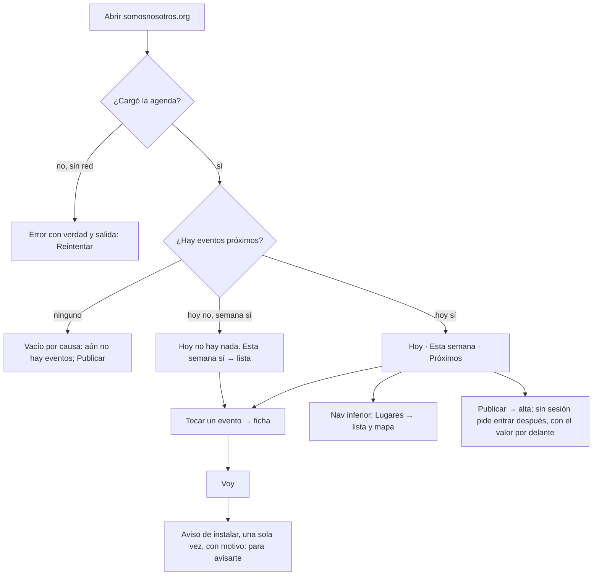

# Inicio · flujo, estados y decisiones de interacción (v2.3, firmada en lo esencial)

**Fecha:** 2026-09-14 · **Base:** [01-inicio-fricciones.md](01-inicio-fricciones.md) (aceptada por el founder) y [LINEA_GRAFICA.md](../diseno/LINEA_GRAFICA.md) · **Carta:** [PRINCIPIOS_UX.md](../PRINCIPIOS_UX.md) · **Prototipo navegable:** [prototipos/inicio.html](prototipos/inicio.html) (publicado para el iPhone en https://claude.ai/artifact/1mnzPWWiZLrHKRnLJ9Gjq6) · **Quién firma:** el founder.

## Diagnóstico

El inicio pasa de "mapa con un panel encima" a "la agenda de la ciudad": lo que da recurrencia se ve en el primer tercio, con una sola acción y una barra fija que orienta. El mapa deja de ser raíz y vive dentro de Lugares. Lo que sigue: el founder recorre el prototipo en su iPhone, corrige las decisiones numeradas y firma; después se implementa en un PR.

## Flujo

## Estados de la pantalla (los cuatro obligatorios y los que la agenda pide)

| ID | Estado | Qué ve la persona | Qué puede hacer | Criterio |
|---|---|---|---|---|
| C1 | Cargando | Barra completa; tres renglones de esqueleto sin texto; nada parpadea si pidió menos movimiento | Nada aún; la barra ya responde | Doherty: la barra pinta al instante, el esqueleto no miente |
| V1 | Vacío total | "Aún no hay eventos próximos." + "Si sabes de uno, publícalo. Los lugares están en su sección." | Publicar; ir a Lugares | Evidencia: el vacío se dice, no se rellena |
| V2 | Hoy vacío, semana con eventos | Grupo Hoy dice "Hoy no hay nada."; sigue Esta semana con su lista | Tocar un evento | Vacío por causa, distinto de V1 |
| H1 | Hoy con eventos | Grupo Hoy primero; dentro solo la hora, el título y el lugar | Tocar un evento | Serial position: lo de hoy primero |
| X1 | Error de red | "No pudimos cargar la agenda." + "Reintentar" | Reintentar | Error con verdad y salida |
| S0 / S1 | Sin sesión / con sesión | Barra: "Entrar" en texto plano, o avatar con el primer nombre | Entrar; ir a Mi perfil | Sin color de acción en la barra |
| P1 | Cercanos sin permiso de ubicación | "Para ordenar por cercanía necesitamos tu ubicación, solo mientras miras la agenda. No se guarda." + botón | Usar mi ubicación | La ubicación se pide con un botón y con motivo |
| P2 | Siguiendo sin sesión | "Aquí verás lo que pasa en los lugares y con los artistas que sigues. Entra para seguir a los tuyos." + Entrar | Entrar | Vacío por causa con salida |
| P3 | Siguiendo sin seguir a nadie | "Todavía no sigues ningún lugar ni artista. En su ficha, toca Seguir y sus eventos aparecerán aquí." | Ir a un lugar o artista | Vacío por causa, distinto de P2 |
| P4 | Nuevos vacío | «Ya estás al día.» si ya miró antes, «Nada nuevo esta semana.» la primera vez; las dos con «¿Sabes de un evento? Publícalo.» + botón Publicar evento (sin cuenta, lleva a Entrar y vuelve al alta). No aparece mientras falta leer la marca de la última visita | Publicar un evento; cambiar de pestaña | Vacío por causa con salida; con el umbral por última visita es el estado más frecuente de la pestaña (founder, 2026-09-17) |
| I1 | Acaba de decir Voy | "¿Te recordamos ese día?" con Por correo · En el teléfono · No, gracias; al elegir uno, confirmación con evidencia y oferta del otro canal una sola vez | Elegir canal; no, gracias | Consentimiento explícito por canal; una decisión a la vez |
| I2 | Hoja "Instala Somos Nosotros" (solo tras el sí) | Pasos con los glifos y textos literales del iPhone, el resultado y el paso de aceptar los avisos; en Android un botón Instalar | Seguir los pasos; cerrar | Progressive disclosure; Jakob |

## Decisiones de interacción (numeradas; cada una cita su ley)

1. **La agenda es la raíz.** Lista por día en pantalla completa con scroll normal; el primer evento queda en el primer tercio. *Atención selectiva, Serial position.* Sustituye al mapa raíz (fricción F1).
2. **Barra superior que se desplaza con el contenido** (no se pega: el logotipo y Entrar solo hacen falta arriba del todo), respeta el área segura: **SMSNSTRS a la izquierda** como enlace al inicio y **la sesión a la derecha**: sin sesión, **"Entrar" como acción primaria** (píldora en el color de acción, 40 px); con sesión, **solo la foto de perfil** (36 px), sin nombre. Sin conteos ni ciudad en la barra. *Jakob (el estándar es nombre del sitio a la izquierda y perfil a la derecha), Región común, Fitts.* (F2; corrección del founder 2026-09-14 sobre la v1, que los tenía al revés.) En pantallas interiores: regreso a la izquierda, SMSNSTRS al centro, nada a la derecha (aceptado por el founder el 2026-09-14).
3. **Una sola cosa brilla en el inicio: "Entrar"**, porque es la conversión que hace posible avisar y decir "Voy". Con sesión ya nada lleva el color de acción: tocar un evento es la acción y los renglones enteros son el accionable. El cuándo va en negro con peso medio, no en rojo. *Von Restorff, Hick.* (F3; corrección del founder 2026-09-14: Entrar es CTA primario.)
4. **Un solo "Publicar"**, botón flotante abajo a la derecha, encima de la barra de navegación, oscuro (color del texto), 48 px, en la zona del pulgar; siempre visible, con o sin sesión: la sesión se pide después, con el valor por delante. Si no hay lugares, lleva a registrar el lugar. *Fitts, Hick, UX invisible.* (F6)
5. **Barra de navegación inferior con los destinos: Agenda · Lugares · Artistas** (Artistas entra al shell desde ya, por decisión del founder; su contenido se define después). 49 px más el área segura; iconos con etiqueta; el destino activo en color de texto y peso 700, el resto en gris. La sección se llama **Lugares**, no Mapa: se nombra por el objeto (el directorio de sitios) y no por la herramienta; el mapa es una de sus dos vistas, junto con la lista. *Modelo mental (vocabulario del mundo de la persona), Jakob.* (Propuesta del founder 2026-09-14, aceptada.) Navegación y acción no se mezclan: la barra navega, el botón Publicar actúa. *Jakob, Modelo mental, Hick.* (F5; decisión del founder 2026-09-14, sustituye a la opción A del v1.)
6. **Dos chips de contexto bajo la barra, ambos accionables**: **fecha** (icono de calendario + "lun 14 sep"; el chip es el campo nativo de fecha, así que el toque abre el selector del teléfono; al elegir un día la agenda muestra solo ese día con su fecha larga como título y el chip enseña ✕ para quitarlo; tocar un segmento también lo quita) y **ubicación** (icono de pin + estado; abre una hoja con **solo los estados que tienen eventos activos** y su cuenta; al elegir uno la agenda se filtra a él). Sustituyen a la línea de orientación pasiva. *UX invisible (el selector nativo se abre directo), Evidencia (solo estados con eventos), Memoria de trabajo.* (Decisión del founder 2026-09-14.)
7. **Renglón de evento**: **foto de 64 px a la izquierda** (la del evento o, si no tiene, la del lugar; si tampoco hay, un cuadro vacío discreto que conserva la forma), título (19 px, 700, ancho 75) y debajo una línea de datos con **iconos**: reloj + hora, pin + lugar, personas + "12 van" (solo si alguien va), boleto + costo o "Gratis". Los iconos son de trazo, 15 px, en gris, sin color. *Similitud (todos los renglones con la misma forma), Chunking (cada dato con su icono se lee sin etiqueta).* (Corrección del founder 2026-09-14: foto a la izquierda; antes a la derecha.) Separación por línea fina y aire, sin fondo gris; el fondo aparece solo al pulsar. *Evidencia, Similitud, Región común.* (F8, F12)
8. **Agrupado por día, como Resident Advisor** (aceptado por el founder el 2026-09-14): los grupos son "Hoy", "Mañana" y después cada día con eventos ("mié 16 de sep", con año si no es el actual), cada uno con su título pegajoso. Dentro de un grupo solo se escribe la hora. Sustituye a los tramos Hoy · Esta semana · Próximos. *Chunking, Memoria de trabajo, Jakob.* (F9)
9. **Grupos por tiempo con título de 19 px y aire de 24 px entre grupos**; el título del grupo dice la cantidad cuando ayuda ("Esta semana · 4"). *Región común, Chunking.* (F12)
10. **Avisos con consentimiento por canal, después del primer "Voy"** (vive en la ficha del evento; en el prototipo del inicio se simula). Hoy el correo sale sin que nadie lo pida; un correo no esperado se marca como spam y con un dominio nuevo eso bloquea la entrega a todos. Por eso **el correo también se pregunta**. **A · Una pregunta, dos canales, una decisión a la vez**: "Vas a X. ¿Te recordamos ese día?" con [Por correo] [En el teléfono] y "No, gracias" en texto. Al elegir uno, la tarjeta confirma con evidencia ("Te escribimos a ro…@gmail.com ese día") y ofrece el otro canal una sola vez ("¿También en el teléfono?"); al final queda una línea ("Te avisamos por correo y en el teléfono ese día. Se cambia en Mi perfil"). "No, gracias" se recuerda. **B · Hoja emergente "Instala Somos Nosotros"** solo al elegir teléfono: "Solo la app instalada recibe avisos. Dos toques:"; Paso 1 · Toca Compartir (miniatura de la barra de Safari); Paso 2 · Elige "Agregar a pantalla de inicio" · Así lo llama el iPhone; Resultado: "Listo. Ábrela desde tu pantalla de inicio, sin Safari"; Después: "Al abrirla, acepta los avisos". En Android, botón "Instalar". En iPhone no existe el toque único (límite de Apple, excepción declarada). **Reglas de datos y correo que esto exige**: consentimiento por persona y canal con fecha (`avisos_correo`, `avisos_push`, `desde`), pedido una vez y válido para recordatorios y eventos nuevos de lo que sigue, editable en Mi perfil; cada correo dice por qué llega y trae baja de un toque sin entrar (enlace firmado y cabeceras List-Unsubscribe / List-Unsubscribe-Post, que Gmail y Yahoo exigen desde 2024); rebotes y quejas de Resend apagan el canal solos; los correos de entrar son transaccionales y no piden consentimiento; seguir un lugar reutiliza el consentimiento ya dado. *Progressive disclosure (pregunta antes que mecanismo), Evidencia (se muestra a qué correo y cuándo), Jakob (texto literal de Apple), Peak-End.* (Corrección del founder 2026-09-14.)
11. **Sin mecánica de panel**: no hay asa, alturas ni arrastre en el inicio. *El gesto gana, Doherty.* (F7)
12. **Vacíos por causa y error con salida**: tres textos distintos para "no hay eventos", "hoy no, esta semana sí" y "no se pudo cargar". *Evidencia, nunca promesa.* (F11)
13. **Reducir movimiento**: el esqueleto no pulsa y nada se desliza si el teléfono lo pide. *El gesto gana.*
15. **Filtros como pestañas de texto: Todos · Cercanos · Siguiendo · Nuevos** (patrón de Resident Advisor, decisión del founder 2026-09-14; sustituye al segmentado por tiempo). Sin fondo: solo tipografía; el activo en color de texto, peso 700 y una línea de 2 px debajo que toca la línea inferior de la cabecera, sin hueco con el contenido, para que pestaña y lista se lean como una sola cosa. **Todos** por defecto (Hoy · Esta semana · Próximos). **Cercanos** ordena por distancia y muestra "a 600 m" junto al lugar; sin permiso de ubicación enseña un vacío con el porqué y un botón "Usar mi ubicación" (la ubicación solo se pide con un botón, DEFINICION). **Siguiendo** muestra los eventos de los lugares y artistas que la persona sigue; sin sesión pide entrar; con sesión y sin seguir a nadie explica dónde está "Seguir". **Nuevos** muestra **lo publicado desde la última vez que miraste esta pestaña, con tope de 7 días**, lo más reciente primero, en grupos por cuándo se publicó («Lo más nuevo» sin fecha, «Publicado ayer», «Esta semana») y con el día del evento en el renglón, que en esta pestaña ya no lo dice el encabezado. La marca de la última visita se guarda en el propio teléfono, avanza solo al mirar Nuevos y el corte se congela mientras la pantalla vive. **Corrección del founder, 2026-09-17:** hasta entonces eran 7 días fijos y la pantalla además tiraba el orden por fecha de publicación, así que lo recién publicado no salía arriba («se acaba de publicar uno hoy y el comportamiento esperado es verlo en la sima de la lista por ser el mas reciente» · «de acuerdo en mostrar nuevos desde la ultima vez que entraste, pero con un tome máximo de 7 días. No olvides empty state que además invite a subir eventos»); el detalle, en [23-nuevos-por-publicacion.md](23-nuevos-por-publicacion.md). El chip de fecha filtra dentro de la pestaña activa. *Jakob, Hick (filtrar es opcional), Evidencia (cada vacío dice su causa), Región común (pestaña y contenido unidos).*
16. **Cabecera y títulos pegajosos**: los chips de fecha y ubicación y el segmentado quedan fijos arriba mientras la lista se desplaza (la barra con el logotipo y Entrar no: se va con el contenido, por decisión del founder); **la zona de contenido lleva un tono distinto** (blanco cálido, `--fondo-contenido`) al de la cabecera y la barra de navegación, que quedan blancas, para que las tres regiones se distingan sin cajas; el título de cada grupo (Hoy, Esta semana, Próximos, o la fecha elegida) se pega debajo de la cabecera mientras se recorren sus renglones y se va cuando el grupo termina. Referencia del founder: Resident Advisor (fecha y ciudad pegadas, títulos de día pegados por fila). *Jakob (patrón conocido en apps de eventos), Memoria de trabajo (siempre se sabe en qué tramo se está sin volver arriba).* (Decisión del founder 2026-09-14.) **Actualizado 2026-09-19 (OL-087, [prototipo](prototipos/cabeceras.html)):** esta cabecera es el modelo de la de Lugares y Artistas (`ui/Cabecera`); al bajar se esconde el renglón de fecha, ciudad y lupa y quedan las pestañas y el título del día; al subir un poco vuelve; tras bajar una pantalla aparece ↑ para volver arriba.
17. **Memoria de pantalla: salir a una ficha y volver no pierde nada** (pedido del founder 2026-09-15: al volver de un evento a la agenda se perdían la pestaña y el scroll, y localizar el punto de lectura en una agenda larga es fricción). La agenda recuerda la pestaña (Todos · Cercanos · Siguiendo · Nuevos), el día elegido, la búsqueda y el scroll; al volver por Atrás o por la barra inferior, aparece exactamente donde se dejó, sin parpadeo y sin robar el foco. **El mismo canon aplica a Lugares (vista Mapa · Lista, lo escrito y el scroll de la lista; el tipo ya vive en la URL) y a Artistas (el filtro vive en la URL; se repone el scroll).** La barra inferior vuelve a la última URL vista de cada sección (su filtro), como las pestañas del teléfono. Vive en sessionStorage del teléfono, una entrada por URL, y muere con la pestaña del navegador; sin sessionStorage (modo privado) no pasa nada. **El scroll lo repone la app en todas las pantallas, no el navegador** (`scrollRestoration = manual`): en el iPhone con la app instalada, WebKit lo reponía a destiempo y la cabecera pegajosa quedaba mal pintada (bitácora 043). *Memoria de trabajo, Jakob (pestañas como en el teléfono), El gesto del usuario gana (no se roba el foco al volver).*
18. **Buscador de eventos en la cabecera, detrás de una lupa** (pedido del founder 2026-09-15). Un chip redondo con la lupa a la derecha de los chips de fecha y ciudad; al tocarlo, el campo ocupa esa misma fila (la cabecera no cambia de alto), con foco y teclado, y la ✕ lo cierra y borra. Filtra al vuelo en el teléfono (los eventos ya están cargados) por título, sitio y artista que se presenta, a medias y sin acentos; con varias palabras, todas tienen que estar. Busca dentro de la pestaña y el día activos; el vacío dice qué se buscó, dónde y la salida ("Nada con «jazz» en Nuevos. Prueba en Todos."). Lo escrito se recuerda al salir y volver (decisión 17). *Progressive disclosure (la lupa antes que el campo), Evidencia (vacío por causa con salida), Hick (un solo campo para todo).*
14. **Pico y final del flujo del inicio**: el pico es ver un evento de hoy que te interesa a primera vista; el final es la ficha del evento con "Voy". El final negativo (no hay nada hoy) se resuelve enseñando lo de la semana sin que la persona haga nada. *Peak-End.*

**Excepciones declaradas:** una, en la decisión 10: en iPhone la instalación exige dos toques dentro del menú de Safari y los avisos push solo llegan a la app instalada (límite de Apple, no de este diseño). Se mitiga con el motivo, los iconos reales y, como alternativa, el aviso por correo que ya existe. Si al implementar alguna decisión choca con Safari iOS (por ejemplo la barra fija con el teclado abierto en otras pantallas), se documenta y se pregunta.

## Fuera de esta pantalla

Lugares (lista, mapa y búsqueda por umbral), ficha de evento, altas. Cada una con su propia lista de fricciones, flujo y prototipo.

## Qué sigue

1. El founder recorre el prototipo en el iPhone (los estados se fuerzan desde el panel de utilería, que no es parte del diseño).
2. Corrige las decisiones 1 a 14 y firma.
3. PR de implementación con captura 390×844 y prueba en el iPhone.
