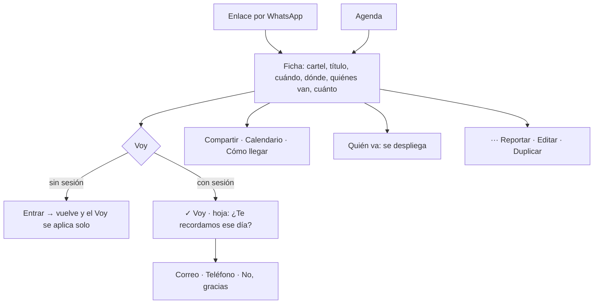

# Ficha de evento · flujo, estados y decisiones de interacción (v1.4)

**Fecha:** 2026-09-14 · **Base:** [03-ficha-evento-fricciones.md](03-ficha-evento-fricciones.md) (aceptada por el founder) · **Carta:** [PRINCIPIOS_UX.md](../PRINCIPIOS_UX.md) · **Prototipo navegable:** [prototipos/ficha-evento.html](prototipos/ficha-evento.html) (publicado para el iPhone en https://claude.ai/artifact/7HYogpGuBLNf7tY8gvpXq4) · **Quién firma:** el founder.

## Diagnóstico

La ficha pasa a tener una sola acción primaria (Voy, pegada abajo), la información con los mismos renglones que la agenda, el cartel entero, quién va compacto y las acciones secundarias como botones de icono con etiqueta, en su propia fila. El color primario deja de ser el rojo: se propone tinta (el negro del texto) para la acción, y el rojo queda solo para errores. El prototipo trae un conmutador para comparar ambos.

## Decisión de color (la pide el founder: "el rojo es muy agresivo")

**Diagnóstico del rojo actual.** `--acento: #b3261e` es a la vez el color de acción, el de los enlaces y el de error (`--error` es el mismo valor). Un botón lleno en rojo lee como alarma o peligro, y cuando todo es rojo nada destaca (Von Restorff). Las apps de eventos y cultura que la gente ya usa (Resident Advisor, Dice, Bandsintown) actúan en blanco y negro y reservan el color para muy poco.

**Propuesta A · Tinta (recomendada).** La acción primaria es el negro del texto (`--primario: #1a1a1a`, texto blanco): Entrar, Voy, Publicar, Guardar. Los botones secundarios van con borde y texto negro. Los enlaces van en color de texto, subrayados. El rojo (`--error`) queda solo para errores y para la acción de borrar. El verde (`--ok`) solo para "✓ Voy" confirmado. La calidez la ponen la letra y el tono del contenido, no el color de los botones. Ya está en uso en el inicio (Publicar, botones de la pregunta de avisos) y funciona.

**Propuesta B · Rojo apagado.** Conservar un acento cálido pero bajarlo a un rojo tierra oscuro (`#7a2a26`), usarlo solo en la acción primaria y quitarlo de enlaces y errores (el error pasa a otro rojo). Menos agresivo que hoy, pero sigue compitiendo con el semáforo de "error" en la cabeza de la persona.

**Decisión del founder (2026-09-14): tinta.** Tras probar el morado en el prototipo se retractó y eligió la propuesta A. `--primario: #1a1a1a` (el negro del texto) con `--primario-suave: #ededeb` para el fondo del estado seleccionado. El rojo (`--error`) queda solo para errores y borrar; el verde (`--ok`) solo para confirmaciones. Se aplica en toda la app en un PR de tokens: Entrar, Voy, Publicar, Guardar, foco visible y el estado seleccionado.

## Flujo

## Estados

| ID | Estado | Qué ve la persona | Qué puede hacer |
|---|---|---|---|
| S0 | Sin sesión | Todo visible; barra inferior con Voy y Me interesa | Voy → entrar y volver con el Voy aplicado |
| S1 | Con sesión, sin Voy | Igual, con su sesión | Voy · Me interesa |
| S2 | Con Voy dicho | Barra: estado seleccionado "✓ Voy · Ya estás en la lista" y botón Cancelar; su avatar al frente en quién va | Cancelar · desplegar quién va |
| S3 | Con Me interesa | Barra: estado seleccionado "✓ Me interesa · Guardado en Mi perfil" y botón Voy | Voy · quitar desde Mi perfil |
| H1 | Hoja de avisos (solo tras el primer Voy) | "Vas a X. ¿Te recordamos ese día?" con las fases de la decisión 10 del inicio | Correo · Teléfono · No |
| C0 | Sin cartel | La información sube; no hay hueco ni cuadro | Igual |
| R1 | Sitio reservado, sin sesión | Renglón de dónde con candado: "Entra para ver la dirección cuando toque" | Entrar |
| R2 | Sitio reservado, con sesión, antes de la hora | "La dirección se revela aquí el sáb 19 a las 16:00" | Esperar |
| R3 | Sitio reservado, revelado | Dirección e indicaciones, con cómo llegar | Cómo llegar |
| P1 | Recién publicado | Aviso "Publicado. Ya está en la agenda." con el botón Compartir dentro | Compartir |
| A1 | Autor o admin | Menú ··· con Editar, Duplicar con otra fecha, Ocultar (admin), Borrar | Cada acción en su pantalla |
| X1 | Borrado o inexistente | "Esto ya no está" (ya existe) | Volver a la agenda |

## Decisiones de interacción

1. **Barra interior sin compartir.** Regreso a la izquierda, SMSNSTRS al centro y solo el menú ··· a la derecha cuando hay algo que poner. Compartir vive una sola vez, en la fila de acciones (decisión 4): el founder señaló la repetición (v1.1). Con esto no hay excepción al shell. *Hick (una acción, un sitio).* (F1, F3)
2. **Cartel a ancho completo llenando una banda baja** de 220 px (cover: se recorta arriba y abajo), con una lupa en la esquina; el toque lo enseña entero a pantalla completa. Sin cartel no hay banda. (v1.3: decisión del founder; el recorte se compensa con el visor.) *Serial position (la información sube), Evidencia (el cartel entero está a un toque).* (F2)
3. **Título y cuatro renglones con icono**, en el orden y con la letra de la agenda: reloj (cuándo, con fin si lo hay), pin (dónde: nombre y dirección), personas (cuántas van; toca y baja a la lista), boleto (precio o Gratis). *Similitud, Chunking.* (F4, F11)
4. **Fila de acciones secundarias como botones de icono con etiqueta**: Compartir · Calendario · Cómo llegar, tres botones iguales de 56 px con borde, icono de 24 px y etiqueta de 13 px debajo; sin color de acción. Se ven como botones (affordance) sin competir con Voy. *Fitts (objetivos grandes y contiguos), Hick (secundarias agrupadas, una decisión aparte).* (F3; ajuste del founder: iconos que se vean como botones)
5. **Descripción** bajo la fila de acciones: 4 líneas y "más" que despliega en el sitio; "Más información" (enlace externo) como renglón discreto al final. *Progressive disclosure.* (F7)
6. **Quién va, compacto**: un renglón con hasta 4 avatares apilados y "Van 12: Ana, Luis y 10 más"; tocar despliega la lista (capa b); "A 3 personas les interesa" en gris. Sin nadie: "Nadie ha dicho que va todavía. Sé la primera persona". *Chunking, Progressive disclosure.* (F6)
7. **Barra inferior pegajosa con la acción primaria**: "Voy" lleno a lo ancho; "Me interesa" en texto a la izquierda. **Tomada la decisión, la barra deja de ser acción y pasa a ser estado** (v1.1: el founder señaló el botón gigante tras el Voy; v1.3: "Vas" no era claro y "Ya no voy" no parecía pulsable): a la izquierda el estado seleccionado con la misma forma del botón pero en el tono suave del primario, con palomita y el mismo verbo, "✓ Voy", y debajo "Ya estás en la lista"; a la derecha "Cancelar" como botón secundario con borde. *Similitud (el estado usa la forma del botón que lo produjo), Evidencia (dice qué pasó), Fitts (Cancelar es un botón, no un texto).* Sin sesión, el mismo botón lleva a entrar y el Voy se aplica al volver. Respeta el área segura. *Fitts, Von Restorff, Evidencia (el estado se ve como estado, no como botón).* (F1, F5)
8. **Hoja de avisos tras el primer Voy**, emergente desde abajo, con las fases ya decididas (decisión 10 del inicio): correo, teléfono, ambos, no. Se cierra sola al terminar. *Progressive disclosure, Peak-End.* (F9)
9. **Menú ··· en la barra** (a la derecha, junto a compartir, solo si hay algo que poner): Reportar; para el autor, Editar, Duplicar con otra fecha; para el admin, Ocultar. Borrar vive dentro de Editar. "Publicado por X" queda al pie como información. *Progressive disclosure (capa c).* (F8)
10. **Sitio reservado en un renglón**: candado en el renglón de dónde y una línea con cuándo se revela o "Entra para verla cuando toque"; al revelarse, dirección e indicaciones con cómo llegar. *Chunking, Evidencia.* (F10)
11. **Recién publicado**: aviso "Publicado. Ya está en la agenda." con el botón Compartir dentro. *Peak-End.* (F12)
12. **Color primario tinta** (`#1a1a1a`) en toda la app; rojo solo para errores y borrar; verde solo para confirmaciones. Ver "Decisión de color" arriba. (Decidido por el founder el 2026-09-14, tras probar y descartar el morado.)
15. **Flujo de "Me interesa"** (el founder preguntó qué pasa; no estaba escrito). Es "guardar para decidir después": cuenta en "A N personas les interesa" (sin nombre: no es compromiso público), se guarda en Mi perfil en una lista "Me interesa" (hoy solo existe "Voy a"; se agrega), y **no dispara la pregunta de avisos** porque no hay compromiso. La barra pasa a estado: "✓ Me interesa · Guardado en Mi perfil" en el tono suave del primario, con el botón "Voy" a la derecha: la salida natural de "me interesa" es decidir. Decir Voy sustituye al interés (nunca los dos). Sin sesión, igual que Voy: entrar y volver con el interés guardado. Alternativa que dejo sobre la mesa: quitar "Me interesa" y dejar solo Voy (Hick); lo conservo porque ya existe en la base y sirve para decidir después sin comprometerse. *Progressive disclosure, Evidencia.*
13. **Reducir movimiento**: la hoja y el despliegue de quién va no animan si el teléfono lo pide.
14. **Pico y final**: el pico es ver el cartel entero y saber en un vistazo cuándo y dónde; el final es "✓ Voy" con tu avatar al frente de quién va y el recordatorio elegido. El final negativo (evento borrado) ya tiene su pantalla.

**Excepciones declaradas:** ninguna (la excepción de compartir en la barra se retiró en v1.1).

## Qué sigue

1. El founder recorre el prototipo en el iPhone (conmutador de color en la utilería).
2. Corrige las decisiones 1 a 14, elige el color (A o B) y firma.
3. PR de implementación: ficha nueva + tokens de color en toda la app; captura 390×844 y prueba en el iPhone.
