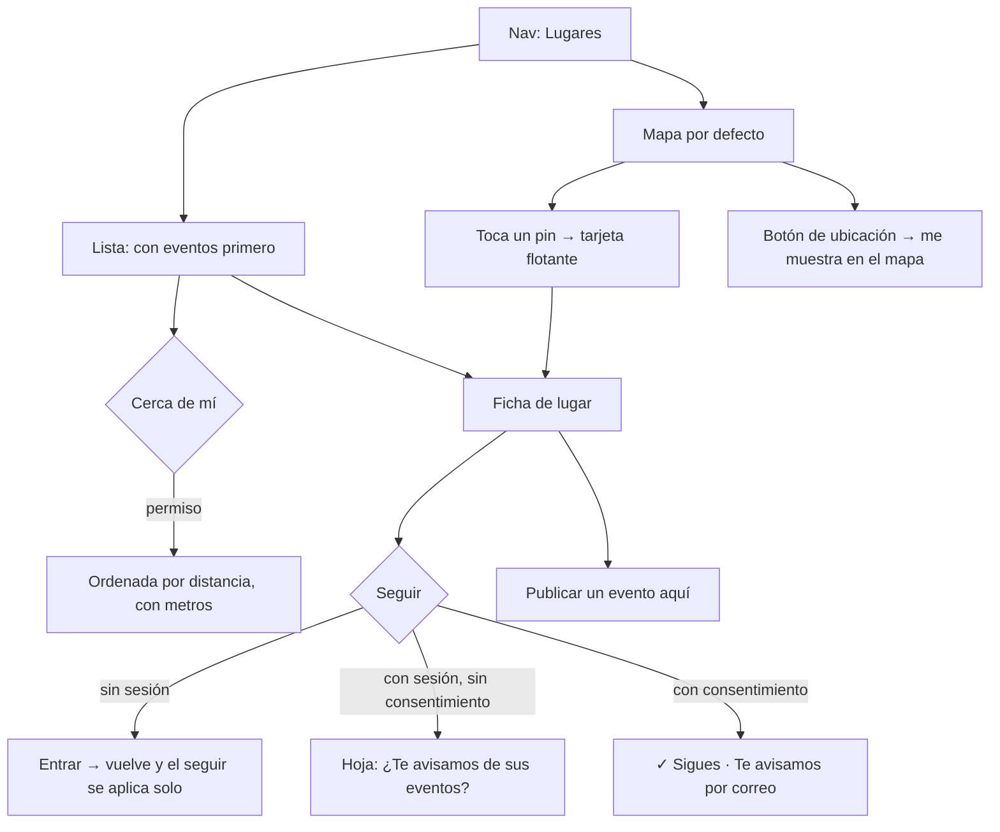

# Lugares · flujo, estados y decisiones de interacción (v1.1)

**Fecha:** 2026-09-14 · **Base:** [05-lugares-fricciones.md](05-lugares-fricciones.md) (aceptada por el founder) · **Carta:** [PRINCIPIOS_UX.md](../PRINCIPIOS_UX.md) · **Prototipo navegable:** [prototipos/lugares.html](prototipos/lugares.html) (publicado para el iPhone en https://claude.ai/artifact/9DpNFzQFhnNtTFsa9711Qm) · **Quién firma:** el founder.

## Diagnóstico

Lugares adopta el lenguaje ya firmado: renglones con icono, acciones como botones de icono, barra inferior pegajosa con la acción primaria, menú "···" y tinta. Lo nuevo de esta pantalla es que la lista y el mapa dicen si el lugar tiene vida (próximo evento), que el mapa muestra antes de llevar (tarjeta flotante al tocar un pin) y que seguir un lugar dice qué pasa después.

## Flujo

## Estados

| ID | Pantalla | Estado | Qué ve la persona | Qué puede hacer |
|---|---|---|---|---|
| L0 | Lista | Sin lugares | "Aún no hay lugares en San Luis Potosí. Registra el primero." | Registrar |
| L1 | Lista | Con lugares | Renglones: foto, nombre, calle, próximo evento; con eventos primero | Tocar; Cerca de mí; buscar (≥8) |
| L2 | Lista | Con ubicación | Los mismos renglones ordenados por distancia, con "a 600 m" | Quitar la ubicación (chip) |
| L3 | Lista | Cerca de mí sin permiso | Vacío con causa y botón "Usar mi ubicación" (no se guarda) | Dar permiso |
| M1 | Mapa | Pins (vista por defecto) | Llenos con eventos próximos, huecos sin; botón de ubicación abajo a la izquierda; Registrar lugar abajo a la derecha | Tocar un pin; ubicarme |
| M3 | Mapa | Con ubicación | Punto azul con halo donde está la persona; el mapa centrado ahí; el botón marcado | Volver a centrar |
| M2 | Mapa | Pin tocado | Tarjeta flotante: foto, nombre, tipo, próximo evento, "Ver" | Ver; tocar fuera cierra |
| F0 | Ficha | Sin sesión | Todo visible; barra con Seguir | Seguir → entrar y volver |
| F1 | Ficha | Con sesión, sin seguir | Igual | Seguir |
| F2 | Ficha | Siguiendo | Barra de estado: "✓ Sigues · Te avisamos por correo" + Dejar de seguir; la persona cuenta en "N lo siguen" | Dejar de seguir |
| H1 | Ficha | Hoja de avisos (solo si no se ha preguntado) | "Sigues Casa 1100. ¿Te avisamos de sus eventos?" Por correo · En el teléfono · No | Elegir canal |
| F3 | Ficha | Sin eventos | "Aún no hay eventos aquí. ¿Organizas algo? Publícalo." + botón | Publicar aquí |
| F4 | Ficha | Sin portada | La información sube; no hay banda | Igual |
| F5 | Ficha | Autor o admin | Menú ··· con Editar, Ocultar (admin), Borrar (con la regla de eventos ajenos) | Cada acción |
| X1 | Ficha | Borrado o inexistente | "Esto ya no está" (ya existe) | Volver |

## Decisiones de interacción

1. **Cabecera pegajosa de Lugares**: pestañas **Mapa · Lista, con el mapa primero y por defecto** (decisión del founder, v1.1: en Lugares el mapa es la vista natural; en Agenda no), y, en la vista de lista, un chip "Cerca de mí" que pide la ubicación con un botón y con motivo (no se guarda), como en Agenda; con ubicación el chip queda activo y muestra ✕ para quitarla. La búsqueda por nombre aparece a partir de 8 lugares. *Jakob, Hick, Evidencia.* (F4)
2. **Renglón de lugar como el de la agenda**: foto de portada de 64 px a la izquierda (sin foto, cuadro discreto), nombre (19 px, 700), y debajo con icono: pin con la calle sin código postal ni ciudad; calendario con "Próximo: hoy 19:30" o "Sin eventos próximos" en gris; con ubicación, la distancia junto a la calle. Sin fondo gris, línea fina entre renglones. *Evidencia, Similitud.* (F1)
3. **Orden**: con eventos próximos primero (por fecha del próximo), luego alfabético; con ubicación, por distancia. *Evidencia (lo vivo primero).* (F4)
4. **Mapa que muestra antes de llevar**: pin lleno en tinta con eventos próximos, hueco sin ellos; tocar un pin abre una tarjeta flotante sobre el mapa (foto, nombre, tipo, próximo evento, "Ver"); tocar fuera la cierra; "Ver" o tocar la tarjeta navega. **Botón de ubicación** abajo a la izquierda: al tocarlo, el teléfono pide permiso una sola vez, la persona aparece en el mapa (punto azul con halo, el estándar de los mapas) y el mapa centra ahí; con la ubicación activa el botón queda marcado y un segundo toque vuelve a centrar. *El gesto gana, Progressive disclosure, Evidencia, Jakob.* (F2, F3; ajuste del founder v1.1)
5. **Ficha: portada en banda** de 220 px en cover con lupa; sin portada, nada. *Serial position.* (F10)
6. **Ficha: título y etiqueta del tipo** (gris, bajo el título); **renglones con icono**: pin (dirección completa), personas ("12 personas lo siguen" o "Nadie lo sigue todavía"), calendario ("Próximo: hoy 19:30" o "Sin eventos próximos"). Descripción en cuatro líneas y "más" si la hay. *Evidencia, Similitud con la ficha de evento.* (F5)
7. **Acciones secundarias como botones de icono**: Cómo llegar · Compartir · y las redes que el lugar tenga (Instagram, Facebook, WhatsApp, Sitio). Tres por fila; si hay más, la fila se desplaza a lo ancho. *Fitts, Hick.* (F7)
8. **Próximos eventos · N**: los mismos renglones de la agenda agrupados por día con títulos pegajosos; al final, botón secundario "Publicar un evento aquí" (alta con el lugar ya elegido). Sin eventos: "Aún no hay eventos aquí. ¿Organizas algo? Publícalo." con el mismo botón. *Similitud, Serial position.* (F8, F9)
9. **Barra inferior pegajosa con Seguir** lleno en tinta a lo ancho. Con decisión, estado seleccionado "✓ Sigues" con "Te avisamos por correo de sus eventos" (o "en el teléfono", o "por correo y en el teléfono", según el consentimiento) y "Dejar de seguir" como botón secundario. Sin sesión, Seguir lleva a entrar y se aplica al volver. *Von Restorff, Fitts, Evidencia.* (F6, F12)
10. **Seguir reutiliza el consentimiento**: si ya se preguntó tras un Voy, no se vuelve a preguntar. Si no, emerge la hoja "Sigues Casa 1100. ¿Te avisamos de sus eventos?" con las mismas fases (Por correo · En el teléfono · No, gracias). *Progressive disclosure, Evidencia.* (F12)
11. **Menú ··· en la barra interior**: Reportar; para el autor, Editar y Borrar (con la regla existente: no se borra un lugar con eventos ajenos); para el admin, Ocultar. "Publicado por X" al pie. *Progressive disclosure.* (F11)
12. **Reducir movimiento**: la tarjeta del pin y las hojas no animan si el teléfono lo pide.
14. **La acción flotante de Lugares es registrar un lugar, no publicar un evento**: copia "Registrar lugar" con icono de pin con más, para que se distinga a simple vista de "+ Publicar" de la Agenda (misma forma y posición, distinto verbo e icono). Dentro de la ficha, "Publicar un evento aquí" sigue siendo un botón secundario al final de los eventos. *Hick (cada sección tiene su acción), Similitud (misma forma, distinta acción).* (Ajuste del founder v1.1.)
13. **Pico y final**: el pico es ver que el lugar tiene un evento pronto; el final es "✓ Sigues" con la promesa concreta de aviso. El final negativo ("Sin eventos próximos") ofrece publicar.

**Excepciones declaradas:** ninguna.

## Qué sigue

1. ~~El founder recorre el prototipo y corrige.~~ **Aprobado el 2026-09-14.**
2. ~~PR con `/lugares` y `/lugares/[id]` nuevos.~~ Implementado (bitácora [021](../bitacora/2026/09/021-lugares-mapa-lista-ficha.md)).
3. Firma del founder en el iPhone tras el despliegue.
