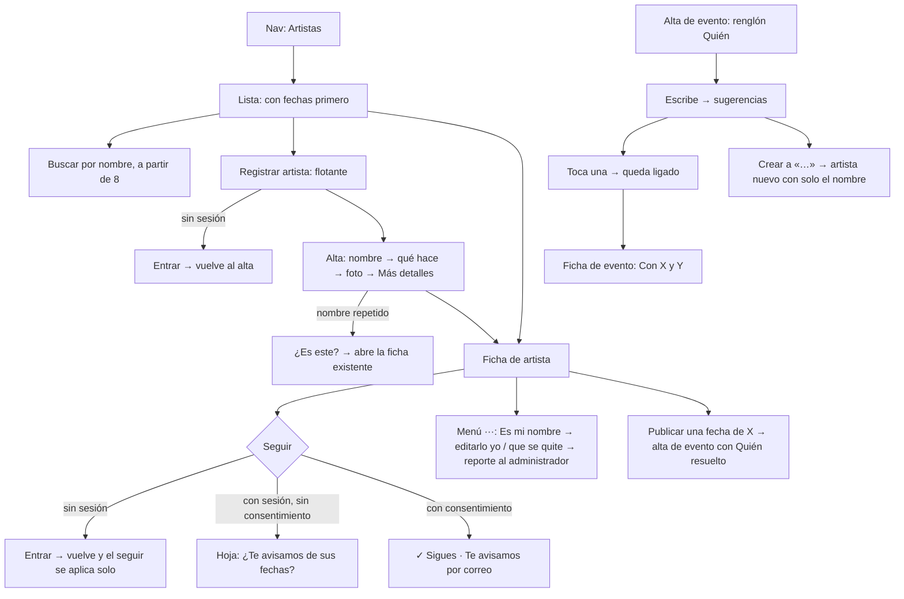

# Artistas · flujo, estados y decisiones de interacción (v1)

**Fecha:** 2026-09-14 · **Base:** [07-artistas-fricciones.md](07-artistas-fricciones.md) (aceptada por el founder) · **Carta:** [PRINCIPIOS_UX.md](../PRINCIPIOS_UX.md) · **Prototipo navegable:** [prototipos/artistas.html](prototipos/artistas.html) (publicado para el iPhone en https://claude.ai/artifact/9X7FNomaYjb2CFsGPhWvjZ) · **Quién firma:** el founder.

## Diagnóstico

Artistas adopta el lenguaje ya firmado (renglones con icono, acciones de icono, barra pegajosa, menú "···", tinta) y la forma de Lugares (lista con vida, ficha con Seguir, acción flotante propia). Lo nuevo de esta sección está en dos sitios: el renglón "Quién" del alta de evento, que liga el evento con el artista sin salir del alta y crea el que falte con solo el nombre; y "Es mi nombre" en el menú de la ficha, la vía para que un artista real reclame o retire su ficha sin escribir correos.

## Flujo

## Estados

| ID | Pantalla | Estado | Qué ve la persona | Qué puede hacer |
|---|---|---|---|---|
| A0 | Lista | Sin artistas | "Aún no hay artistas registrados. ¿Eres artista o grupo, o conoces a alguien? Regístralo." | Registrar |
| A1 | Lista | Con artistas | Renglones: foto redonda, nombre, qué hace · qué es, próxima fecha con lugar; con fechas primero | Tocar; buscar (≥8) |
| A2 | Lista | Buscando | Solo los que coinciden; "Nadie se llama así. ¿Lo registras?" si no hay | Registrar con el nombre ya escrito |
| F0 | Ficha | Sin sesión | Todo visible; barra con Seguir | Seguir → entrar y volver |
| F1 | Ficha | Con sesión, sin seguir | Igual | Seguir; menú ··· con "Es mi nombre" |
| F2 | Ficha | Siguiendo | "✓ Sigues · Te avisamos por correo de sus fechas" + Dejar de seguir; cuenta en "N lo siguen" | Dejar de seguir |
| H1 | Ficha | Hoja de avisos (solo si no se ha preguntado) | "Sigues Los Vecinos. ¿Te avisamos de sus fechas?" Por correo · En el teléfono · No | Elegir canal |
| F3 | Ficha | Sin fechas | "Aún no tiene fechas publicadas. ¿Sabes de una? Publícala." + botón | Publicar una fecha |
| F4 | Ficha | Sin portada | La información sube; sin banda | Igual |
| F5 | Ficha | Autor o administrador | Menú ··· con Editar, Ocultar (admin), Borrar | Cada acción |
| R1 | Ficha | Es mi nombre (con sesión) | Hoja: "¿Qué quieres hacer con Los Vecinos?" Quiero editarlo yo · Quiero que se quite | Elegir |
| R2 | Ficha | Es mi nombre, enviado | "Listo. El administrador lo revisa y te escribe a ro…@gmail.com." | Cerrar |
| X1 | Ficha | Borrado, oculto o inexistente | "Esto ya no está" (ya existe) | Volver |
| N1 | Alta de artista | Vacía | Nombre con foco; Qué hace y Es resueltos con lo deducido; foto y Más detalles plegados | Escribir el nombre |
| N2 | Alta de artista | Nombre repetido | "Ya está registrado: Los Vecinos · Son huasteco. ¿Es este?" Sí, es este · No, es otro | Abrirlo o seguir |
| N3 | Alta de artista | Publicado | Ficha con "Publicado. Ya está en Artistas." y Completar o Compartir | Completar; compartir |
| N4 | Alta de artista | Error al publicar | Error en línea en el campo que falla (nombre vacío o demasiado largo; foto que no sube) | Corregir |
| Q0 | Alta de evento | Quién vacío | Renglón "Quién · Añadir quién se presenta" en gris; no detiene la publicación | Tocar |
| Q1 | Alta de evento | Quién abierto, escribiendo | Campo con sugerencias a partir de dos letras: los míos primero, luego por nombre; al final "Crear a «…»" si no coincide exacto | Tocar una; crear |
| Q2 | Alta de evento | Quién resuelto | "Quién · Los Vecinos y Trío Xochitl" con fichas ✕ al abrir | Quitar; añadir otro |
| Q3 | Alta de evento | Mi cuenta ligada a un artista | Quién ya resuelto: "Los Vecinos · tú" con Cambiar | Cambiar |
| V1 | Ficha de evento | Con artistas | Renglón de estrella "Con Los Vecinos y Trío Xochitl", cada nombre enlaza | Ir a la ficha |

## Decisiones de interacción

1. **Lista de artistas con la forma de Lugares**: foto redonda de 64 px (sin foto, círculo discreto), nombre (19 px, 700) y debajo con icono: la disciplina ("Son huasteco · Grupo") y calendario con "Próximo: hoy 19:30 · Casa Ocho Ventanas" o "Sin fechas próximas" en gris. Conteo arriba. Sin fondo gris, línea fina entre renglones. *Evidencia, Similitud.* (F1)
2. **Orden**: con fechas próximas primero (por la fecha), luego alfabético. **Búsqueda** por nombre a partir de 8; sin resultados, "Nadie se llama así. ¿Lo registras?" con el nombre ya puesto en el alta. **Chips de disciplina** solo a partir de 12 (Todos · Música · Teatro · Danza · Artes visuales · Letras). *Construido el 2026-09-14 (bitácora 030), con un segundo nivel por detalle (género o técnica) cuando al menos dos detalles reúnen 3 artistas: pendiente de firma. "Artes circenses" entra como disciplina propia el mismo día (migración 0012). Desde el 2026-09-14 el filtro vive en la URL (`?hace=&que=&q=&n=`), lo aplica el servidor y la lista se pagina de 100 en 100 con "Ver más".* *Hick, Evidencia.* (F5) **Actualizado 2026-09-19 (OL-087, [prototipo](prototipos/cabeceras.html)):** la búsqueda va tras la lupa de la cabecera común (ciudad y lupa arriba) y las disciplinas son pestañas; el detalle sigue en chips, como segundo nivel.
3. **Acción flotante de Artistas: "Registrar artista"** con icono de estrella con más; sin sesión lleva a entrar y vuelve. *Hick, Similitud (decisión 14 de Lugares).* (F6)
4. **Alta de artista una cosa a la vez**: Nombre (foco); renglones resueltos "Qué hace" (chips: Música · Teatro · Danza · Artes visuales · Letras · Cine · Otro, con un campo corto opcional "en una palabra": son huasteco, jazz, grabado) y "Es" (Solista · Grupo · Colectivo, deducido del nombre: "Los", "Las", "Trío", "Cuarteto", "Banda", "Compañía" proponen Grupo; "Colectivo" propone Colectivo; se cambia con un toque); "Elegir una foto" (opcional); interruptor "Soy yo / es mi grupo" (apagado); "+ Más detalles: redes, descripción". Botón "Publicar artista". Salir y volver no pierde lo escrito (borrador local). *UX invisible, Hick, Gradiente de meta, Zeigarnik.* (F7, F12)
5. **Un artista es un artista**: al escribir el nombre (en el alta o en Quién), si ya existe uno igual sin acentos ni mayúsculas, aparece "Ya está registrado: Los Vecinos · Son huasteco. ¿Es este?" con "Sí, es este" (abre la ficha o lo liga) y "No, es otro". *Prevención antes que corrección.* (F8)
6. **Ficha: portada en banda** de 220 px con lupa; sin portada, nada. **Título y etiqueta** ("Son huasteco · Grupo"). **Renglones con icono**: personas ("12 personas lo siguen" o "Nadie lo sigue todavía"), calendario ("Próximo: hoy 19:30 · Casa Ocho Ventanas" con "ver", o "Sin fechas próximas"). Descripción en cuatro líneas y "más". *Serial position, Evidencia, Similitud.* (F4)
7. **Acciones de icono**: Compartir · Instagram · Facebook · YouTube · Spotify · WhatsApp · Sitio, solo las que tenga; tres por fila, con más se desplaza. YouTube y Spotify se añaden a las redes (también quedan disponibles para lugares). *Fitts, Hick.* (F4)
8. **"Se presenta en · N"**: los renglones completos de la agenda (hora, lugar, asistentes, costo) agrupados por día con títulos pegajosos; al final, botón secundario "Publicar una fecha de Los Vecinos" (alta de evento con Quién ya resuelto). Sin fechas: "Aún no tiene fechas publicadas. ¿Sabes de una? Publícala." con el mismo botón. *Similitud, Serial position, Evidencia.* (F4, F11)
9. **Barra pegajosa con Seguir**, igual que en Lugares: lleno a lo ancho; con decisión, "✓ Sigues" con la promesa concreta según el consentimiento ("Te avisamos por correo de sus fechas", "en el teléfono", ambos, o "Sin avisos; se cambia en Mi perfil") y "Dejar de seguir". Sin sesión, lleva a entrar y se aplica al volver. *Von Restorff, Fitts, Evidencia.* (F10)
10. **Seguir reutiliza el consentimiento**: la misma hoja de avisos con el nombre del artista ("Sigues Los Vecinos. ¿Te avisamos de sus fechas?"); si ya se preguntó, no se repite. Los avisos de evento nuevo salen también a quienes siguen a un artista del evento (una sola vez por persona aunque siga al lugar y al artista). *Progressive disclosure, Evidencia.* (F10)
11. **Menú ···**: Reportar; **"Soy yo / es mi grupo"** (antes "Es mi nombre"; cambiado por el founder el 2026-09-14 porque no dejaba claro que se pide la ficha) (con sesión; sin sesión, lleva a entrar y vuelve a la hoja); para el autor, Editar y Borrar; para el administrador, Ocultar. La hoja pregunta "¿Eres Los Vecinos?" → "Sí, quiero llevar yo la ficha" o "Sí, y quiero que se quite"; ambas crean un reporte con la cuenta que lo pidió y terminan con "Listo. El administrador lo revisa y te escribe a ro…@gmail.com." En el panel del administrador, el reporte trae "Pasar la ficha a esta cuenta" u "Ocultar". "Registrado por X" al pie de la ficha. *Progressive disclosure, Evidencia, nunca promesa.* (F9)
12. **Quién en el alta de evento**: cuarto renglón resuelto, debajo de Dónde, resumen "Añadir quién se presenta" en gris; opcional, no detiene la publicación. Abierto: campo "Nombre del artista o grupo" con sugerencias a partir de dos letras (los artistas ligados a mi cuenta primero, luego por nombre, máximo cinco); tocar una lo deja como ficha con ✕; se pueden añadir varios; si no coincide exacto, la última sugerencia es "Crear a «Trío Xochitl»", que lo crea con solo el nombre (disciplina "por completar") y lo liga. La lectura del cartel propone los nombres que reconoce. Si mi cuenta está ligada a un artista, Quién ya viene resuelto ("Los Vecinos · tú") con Cambiar. *UX invisible, Hick, Postel, Gradiente de meta.* (F2, F12)
13. **Ficha de evento con quién**: renglón con icono de estrella después de Dónde, "Con Los Vecinos y Trío Xochitl", cada nombre enlaza a su ficha; sin artistas, no aparece. El renglón de la agenda no cambia. *Evidencia, Hick.* (F3)
14. **Reducir movimiento**: hojas y sugerencias no animan si el teléfono lo pide. *El gesto gana.*
15. **Pico y final**: el pico es ver que el grupo tiene una fecha pronto y dónde; el final es "✓ Sigues" con la promesa concreta, o, para quien registra, "Publicado. Ya está en Artistas." El final negativo ("Sin fechas próximas") ofrece publicar una. Para el artista real que encuentra su nombre puesto por otro, el final es "Listo. El administrador lo revisa": una salida sin escribir a nadie.

**Excepciones declaradas:** ninguna.

## Modelo de datos (para el PR)

- **`artistas`**: `id`, `nombre` (1–80), `disciplina` (`musica` · `teatro` · `danza` · `artes_visuales` · `letras` · `cine` · `otro` · `por_completar`), `detalle` (≤40, "son huasteco"), `tipo` (`solista` · `grupo` · `colectivo`), `descripcion` (≤600), `foto`, `redes` jsonb (mismas claves que lugares más `youtube` y `spotify`), `ciudad`, `creado_por`, `visible`, fechas. Índice único por `ciudad` y nombre normalizado (regla 5). Lectura pública; escribe quien tiene sesión; edita el autor o el administrador (mismas políticas que `lugares`).
- **`artistas_cuentas`**: `artista_id`, `perfil_id` (una cuenta puede estar ligada a varios artistas; decisión 4 y 12). Se llena con "Soy yo / es mi grupo" o cuando el administrador atiende "Quiero editarlo yo". Estar ligado da permiso de editar.
- **`eventos_artistas`**: `evento_id`, `artista_id`, `orden`. Se escribe con el evento (alta, edición, duplicado, lectura del cartel).
- **`seguimientos`**: nueva columna `artista_id` (nula), con la regla de que exactamente una de `lugar_id` o `artista_id` va llena; la llave primaria pasa a incluir ambas. `avisar()` junta a quienes siguen al lugar y a los artistas del evento, sin repetir.
- **`reportes`**: `tipo` admite `artista`; `motivo` admite `es_mio` y `retirar` (decisión 11). El panel del administrador muestra "Pasar la ficha a esta cuenta" (inserta en `artistas_cuentas`) u "Ocultar".
- Antes de la migración, copia de la base (regla del consejo para cualquier cambio que no sea una columna nula).

## Qué sigue

1. ~~El founder corrige la lista de fricciones (07), recorre el prototipo y firma.~~ **Firmado el 2026-09-14.**
2. ~~PR: migración, `/artistas`, `/artistas/[id]`, `/artistas/nuevo` y `/artistas/[id]/editar`, renglón Quién en el alta de evento, renglón en la ficha de evento, "Es mi nombre" en el panel del administrador.~~ Implementado (bitácora [023](../bitacora/2026/09/023-artistas-implementacion.md)). Ajuste al implementar: "Pasar la ficha a esta cuenta" también transfiere el autor.
3. Firma del founder en el iPhone tras el despliegue.
