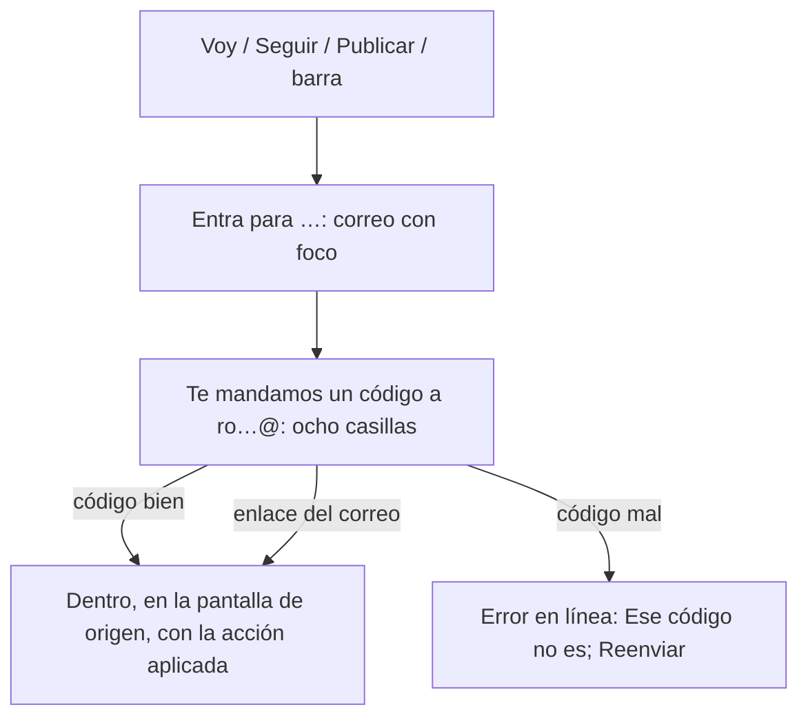
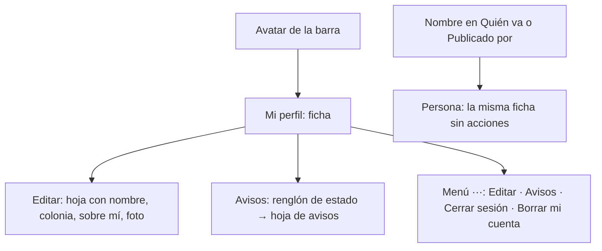

# Pantallas restantes · flujo, estados y decisiones (v1)

**Fecha:** 2026-09-14 · **Base:** [10-restantes-fricciones.md](10-restantes-fricciones.md) (v1, pendiente de la corrección del founder) · **Carta:** [PRINCIPIOS_UX.md](../PRINCIPIOS_UX.md) · **Prototipo navegable:** [prototipos/restantes.html](prototipos/restantes.html) (Entrar, Mi perfil, persona y alta de lugar; publicado para el iPhone en https://claude.ai/artifact/P8Rxff38ujtfucDgDENuRE) · **Quién firma:** el founder.

## Entrar

| ID | Estado | Qué ve la persona | Qué puede hacer |
|---|---|---|---|
| E0 | Llega | "Entra para decir que vas" (o el motivo que toque); campo con foco; "Mandarme el código" sobre el teclado | Escribir |
| E1 | Correo mal | Error en línea bajo el campo | Corregir |
| E2 | Código enviado | "Te mandamos un código a ro…@gmail.com. También trae un enlace, por si prefieres." Seis casillas con foco, teclado numérico | Teclear o pegar; Reenviar (tras 30 s); Usar otro correo |
| E3 | Código mal o caducado | "Ese código no es, o ya caducó." + Reenviar | Reintentar |
| E4 | Dentro | La pantalla de origen con la acción aplicada (✓ Voy, ✓ Sigues, el alta) | Seguir |
| E5 | Google configurado | Además, "Continuar con Google" bajo el campo | Elegir |

1. **Motivo en el título** según `siguiente`: "Entra para decir que vas", "Entra para seguir a X", "Entra para publicar", "Entrar". El regreso vuelve al origen. *Gradiente de meta, Evidencia.* (E3)
2. **Código de 8 dígitos y enlace**: el correo trae ambos; la pantalla pide el código (ocho casillas, `inputmode=numeric`, `autocomplete=one-time-code` para que el iPhone lo ofrezca solo), con Reenviar y Usar otro correo. El enlace sigue vivo. Precondición: `{{ .Token }}` en la plantilla "Magic Link" de Supabase (hecho por el founder el 2026-09-14). El largo del código lo fija Supabase (Authentication → Providers → Email → OTP length); en este proyecto son 8 dígitos y la pantalla lo lee de `NEXT_PUBLIC_LARGO_CODIGO` (8 por defecto). *Peak-End, Evidencia.* (E1)
3. **Google solo si hay credenciales** (variable pública que lo anuncia). *Evidencia, nunca promesa.* (E2)
4. **Foco, teclado y botón sobre el teclado.** *Fitts.* (E4)

## Mi perfil y perfil de persona

| ID | Estado | Qué ve la persona | Qué puede hacer |
|---|---|---|---|
| P0 | Mi perfil completo | Foto, nombre, colonia, sobre mí; renglón Avisos con estado; "Voy a · N" y "Sigo · N" con renglones | Editar; Cambiar avisos; tocar renglones |
| P1 | Mi perfil incompleto | Sin foto: círculo con inicial; sin colonia ni sobre mí: renglón "Completa tu perfil · Editar" | Editar |
| P2 | Editando | Hoja: foto (tocar para cambiar), Nombre, Colonia, Sobre mí, "Entras con ro…@gmail.com", Guardar | Guardar; cerrar |
| P3 | Avisos | Hoja de avisos: Por correo (✓/–), En el teléfono (✓/–), cada uno con un interruptor; en iPhone sin instalar, la hoja de instalar | Cambiar |
| P4 | Voy a vacío | "Todavía no vas a nada. Ver la agenda" | Ir |
| P5 | Sigo vacío | "Todavía no sigues nada. Ver lugares · Ver artistas" | Ir |
| P6 | Borrar | Confirmación de dos pasos (existe) | Borrar; cancelar |
| R0 | Persona | Misma ficha sin Editar, Avisos ni menú; "Va a · N", "Sigue · N" | Tocar renglones |

5. **Una sola ficha de persona** para `/perfil` y `/personas/[id]`: foto redonda (96 px), nombre (26 px), colonia y sobre mí; la mía con Editar y el renglón de Avisos; la ajena sin acciones. El correo solo en la hoja de edición. *Evidencia, Similitud, Hick.* (P1, P4, Q1)
6. **Editar en una hoja**: foto (tocar), Nombre, Colonia, Sobre mí, Guardar; los errores en línea; al guardar, la ficha se actualiza y la hoja se cierra. *Progressive disclosure.* (P1)
7. **Avisos como renglón de estado** ("Por correo y en el teléfono", "Sin avisos") con Cambiar → hoja con dos interruptores; la hoja de instalar cuando el teléfono lo exige. Se guarda al tocar, sin Guardar. *UX invisible, Evidencia.* (P2)
8. **Menú ···**: Editar · Avisos · Cerrar sesión · Borrar mi cuenta. *Progressive disclosure.* (P3)
9. **Voy a y Sigo con renglones**: agenda por día; lugares (foto cuadrada) y artistas (redonda) con etiqueta; vacíos con salida. *Similitud, Evidencia.* (P5)

## Alta de lugar

| ID | Estado | Qué ve la persona | Qué puede hacer |
|---|---|---|---|
| L0 | Llega | Nombre con foco; "Dónde" abierto con "Estoy aquí" y el mapa; "Tipo · Otro · por el nombre" resuelto | Escribir; ubicarse |
| L1 | Sugerencia elegida | Dónde resuelto: "Calle 5 de Mayo 1100 · Cambiar"; Tipo resuelto con lo deducido | Publicar |
| L2 | Dónde abierto | Mapa con el pin, campo de dirección, Estoy aquí | Mover el pin |
| L3 | Ya existe cerca | "¿Es este?" (existe) | Abrirlo; publicar de todos modos |
| L4 | Publicado | Ficha con "Publicado" y Completar / Compartir (existe) | — |

10. **Renglones resueltos**: Nombre (sugiere lugares y avisa de repetidos, como hoy); "Dónde" resuelto en cuanto algo lo resuelve (sugerencia o Estoy aquí) y abierto si no; "Tipo" deducido del nombre con chips al abrir; "+ Más detalles: descripción, redes, foto" con el selector de enlaces. *UX invisible, Hick, Similitud.* (L1, L2, L3)

## Alta de evento (ajustes)

11. **Dónde**: con seis lugares o menos, chips con el nombre; con más, campo que sugiere; "Es en otro sitio…" como una píldora que despliega las dos opciones. *Hick.* (V1)
12. **Leer cartel** como botón de icono junto a "Qué". *Von Restorff, Fitts.* (V2)

**Excepciones declaradas:** ninguna.

## Qué sigue

1. El founder corrige 10, recorre el prototipo y firma.
2. ~~PR 1: Entrar (código, motivo, Google condicional) + plantilla de correo (founder).~~ Implementado (bitácora [026](../bitacora/2026/09/026-entrar-con-codigo.md)). PR 2: ficha de persona (perfil y personas), hoja de edición, avisos. PR 3: alta de lugar. PR 4: ajustes del alta de evento.
