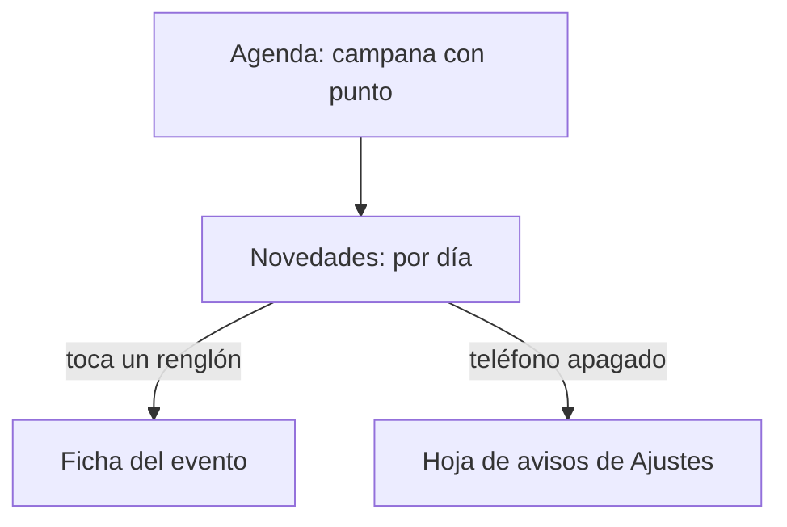
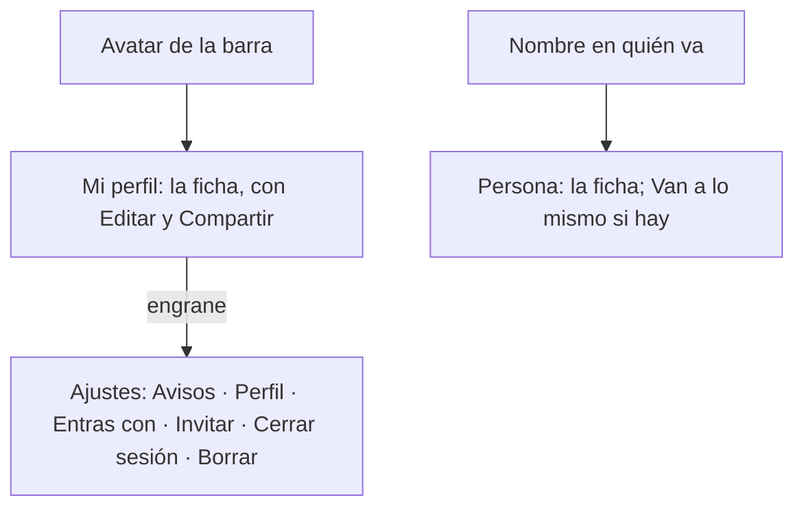
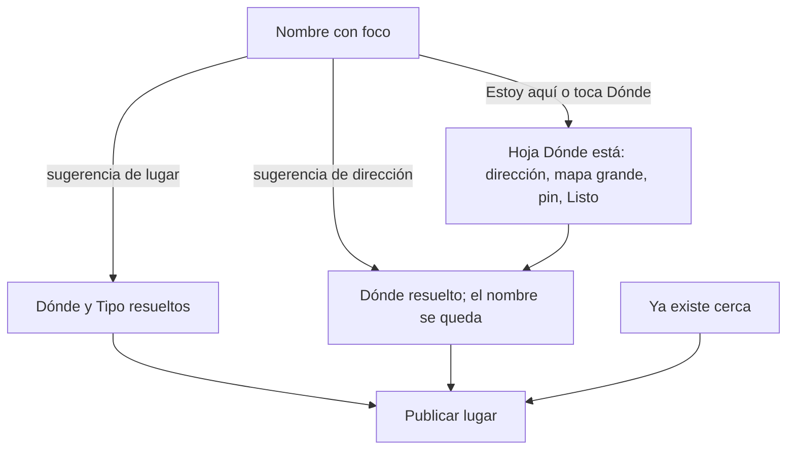

# Novedades, perfil y alta de lugar · flujo, estados y decisiones (v1)

**Fecha:** 2026-09-15 · **Base:** [12-novedades-perfil-alta-fricciones.md](12-novedades-perfil-alta-fricciones.md) (v1, pendiente de la corrección del founder) · **Carta:** [PRINCIPIOS_UX.md](../PRINCIPIOS_UX.md) · **Prototipo navegable:** [prototipos/novedades-perfil-alta.html](prototipos/novedades-perfil-alta.html) (publicado para el iPhone en https://claude.ai/artifact/5GDgjLVpsy3h26TgsnYEaN) · **Quién firma:** el founder.

## Novedades

| ID | Estado | Qué ve la persona | Qué puede hacer |
|---|---|---|---|
| N0 | Hay novedades | Hoy · Ayer · Esta semana; renglones con icono por causa; punto en lo no visto; el punto de la campana se apaga al entrar | Tocar un renglón |
| N1 | Nada nuevo | "Nada nuevo desde el lunes. Sigues 3 lugares y 2 artistas." y lo último que hubo | Volver |
| N2 | No sigue nada | "Todavía no sigues nada… Ver lugares · Ver artistas" | Ir a seguir |
| N3 | Sin sesión | No hay campana; la ruta responde con la invitación a entrar | Entrar |
| N4 | Teléfono apagado | Al pie: "Esto también te llega por correo. En el teléfono aún no: actívalo" | Activar |

1. **Novedades se calcula, no se administra**: nuevos de las últimas dos semanas en lo que sigue, cambios en lo que va, hoy vas, y (si el founder lo firma) quién más va. Una sola fecha guardada por persona (`novedades_vistas_en`) decide el punto de la campana y el punto por renglón. *UX invisible, Evidencia.* (N0)
2. **Campana solo con sesión**, con punto y sin número. *Hick, Evidencia.* (N0, N3)
3. **Cuatro vacíos por causa** (N1 a N4), cada uno con su salida. *Evidencia.*
4. **El aviso del teléfono aparece solo cuando está apagado** y desaparece al activarlo. *UX invisible.* (N4)

## Mi perfil, Ajustes y perfil ajeno

| ID | Estado | Qué ve la persona | Qué puede hacer |
|---|---|---|---|
| P0 | Mi perfil | Ficha idéntica a la ajena + Editar · Compartir; engrane en la barra | Editar, compartir, ir a Ajustes |
| P1 | Incompleto | Renglón "Completa tu perfil…" con Editar | Editar |
| S0 | Ajustes | Avisos · Perfil (público/reservado) · Entras con ro…@ · Invita a tus amigos · (Administración) · Cerrar sesión; Borrar mi cuenta aparte, al final y en rojo; pie legal | Cambiar cada uno en su hoja |
| R0 | Persona | Ficha sin acciones salvo Compartir | Tocar renglones |
| R1 | Coincidencias | "Van a lo mismo · N" antes de "Va a" (con sesión y si hay) | Tocar |

5. **Mi perfil es la ficha**: lo único distinto de la ajena son Editar, "Completa tu perfil" y el engrane. Los renglones de Avisos y Perfil reservado, Invitar, Cerrar sesión, Borrar y Administración se van a Ajustes; el menú ··· desaparece de Mi perfil. *Hick, Progressive disclosure, Jakob.* (P0, S0)
6. **Ajustes es una lista de renglones de estado**, cada uno con su hoja ya firmada (avisos, perfil reservado) o su acción; lo destructivo al final y en rojo, con la confirmación de dos pasos que ya existe. *Progressive disclosure, Von Restorff.* (S0)
7. **"Van a lo mismo"** lo calcula el sistema y solo aparece con sesión y si hay coincidencias. Por decidir. *UX invisible, Peak-End.* (R1)

## Alta de lugar

| ID | Estado | Qué ve la persona | Qué puede hacer |
|---|---|---|---|
| L0 | Llega | Nombre con foco y teclado; "Dónde" pendiente ("Elige el lugar arriba, o dinos dónde está · Estoy aquí"); "Tipo · Se deduce del nombre"; Publicar dice "falta el nombre" | Escribir; Estoy aquí |
| L1 | Escribió | Sugerencias: lugares con nombre (nombre, categoría, dirección) y direcciones ("workshop · Usar la dirección …"); Publicar sobre el teclado dice "falta dónde está" | Elegir |
| L2 | Lugar elegido | Dónde resuelto "Av. Carranza 850 · Lo trajo el nombre · a 400 m de ti"; Tipo resuelto por Mapbox; Publicar activo | Publicar; Cambiar |
| L3 | Dirección elegida o pin puesto | Dónde resuelto "Dirección elegida · el pin está en esa calle"; el nombre escrito se queda; Tipo por el nombre | Publicar; Cambiar |
| L4 | Ya existe cerca | "Ya está registrado: … Si es otro con el mismo nombre, sigue adelante" | Abrir el existente; publicar |
| H | Hoja Dónde está | Campo de dirección, Estoy aquí, mapa grande con el punto azul y el pin, dirección deducida, Listo | Mover el pin; Listo |

8. **Una cosa a la vez con renglones resueltos**, como el alta de evento (decisión 10 de [11](11-restantes-flujo-y-estados.md)); no se pagina (fricción L5). *Hick, Gradiente de meta, Similitud.* (L0 a L3)
9. **Una dirección ubica, no nombra** (ya en producción): las direcciones se ven distintas en la lista y nunca sustituyen el nombre escrito. *Evidencia, Postel.* (L1, L3)
10. **El mapa vive en la hoja "Dónde está"**, a toda la pantalla, y se abre solo si hace falta (tocar Dónde o Estoy aquí); la dirección se deduce del pin. *Fitts, UX invisible.* (H)
11. **Publicar dice qué falta** cuando está deshabilitado ("falta el nombre", "falta dónde está") y viaja sobre el teclado mientras se escribe. *Evidencia, Fitts.* (L0, L1)

**Excepciones declaradas:** ninguna.

## Qué sigue

1. El founder corrige 12, recorre el prototipo y firma.
2. PR A: Novedades (ruta, campana, fecha de visto). PR B: Ajustes y Mi perfil solo actividad (mueve lo ya hecho). PR C: alta de lugar con renglones resueltos y la hoja del mapa (cierra el PR 3 de OL-010).
