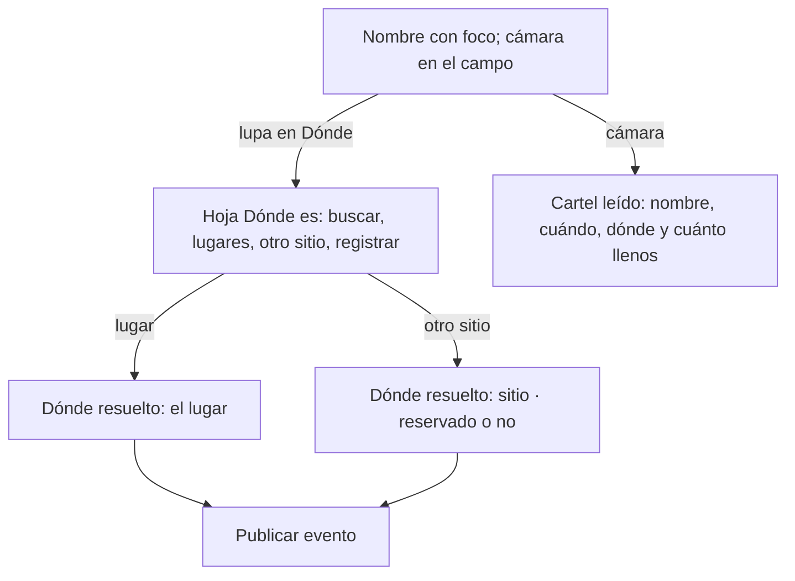

# Formularios con el canon · flujo, estados y decisiones (v1.1, firmado con una corrección)

**Fecha:** 2026-09-15 · **Base:** [14-formularios-canon-fricciones.md](14-formularios-canon-fricciones.md) (v1, pendiente de la corrección del founder) · **Carta:** [PRINCIPIOS_UX.md](../PRINCIPIOS_UX.md) · **Canon:** bitácora [039](../bitacora/2026/09/039-alta-de-lugar-canon.md) · **Prototipo navegable:** [prototipos/formularios-canon.html](prototipos/formularios-canon.html) (publicado para el iPhone en https://claude.ai/artifact/Xkr2KNKgss57WtxFR7UgVo) · **Quién firma:** el founder.

## Alta de evento

| ID | Estado | Qué ve la persona | Qué puede hacer |
|---|---|---|---|
| V0 | Llega | Campo "Nombre del evento" con foco y la cámara dentro; Cuándo · Hoy · 19:00; Dónde · Falta con la lupa; Quién · Sin artista; Cuánto · Gratis; Más; Publicar dice "falta el nombre" | Escribir; leer el cartel; buscar el lugar |
| V1 | Escribió | Publicar sobre el teclado dice "falta dónde" | Buscar el lugar |
| V2 | Hoja Dónde es | Campo con foco, lugares registrados con foto y calle (se filtran al escribir), "Es en otro sitio", "Registrar un lugar nuevo" | Elegir |
| V3 | Lugar elegido | Dónde · Casa Ocho Ventanas · Cambiar; Publicar activo | Publicar |
| V4 | Otro sitio | Dónde · Jardín de Tequis · otro sitio (o "· reservado") · Cambiar | Publicar |
| C | Cartel leído | Los renglones se llenan con lo leído y se ven resueltos | Corregir, publicar |

1. **Un campo arriba, el nombre, con la cámara dentro** (tooltip "Leer el cartel"); sin etiqueta ni frase. *Von Restorff, UX invisible.* (V0, C)
2. **Dónde con una sola salida**: la lupa abre la hoja "Dónde es" (lugares registrados, otro sitio con reservado dentro, registrar uno nuevo). Sustituye al desplegable, al enlace y a las dos píldoras; cierra la decisión 11 de [11](11-restantes-flujo-y-estados.md). *Hick, Similitud, Fitts.* (V2 a V4)
3. **Todos los renglones con el mismo dibujo** (Cuándo, Dónde, Quién, Cuánto, Más) y el botón dice qué falta. *Conectividad uniforme, Evidencia.* (V0, V1)

## Alta de artista

| ID | Estado | Qué ve la persona | Qué puede hacer |
|---|---|---|---|
| A0 | Llega | Campo con estrella "Nombre del artista o grupo" con foco; Qué hace · Por el nombre; Es · Solista; Foto · Sin foto (cámara); Soy yo / es mi grupo · No (interruptor); Más; Publicar dice "falta el nombre" | Escribir |
| A1 | Escribió un nombre que existe | "Ya está registrado: Los Vecinos · Son huasteco. Ábrelo y, si es tuyo, dilo ahí."; el botón dice "ya está registrado" (la base no admite dos artistas con el mismo nombre, decisión 5 de [08](08-artistas-flujo-y-estados.md); corregido al construir el PR E) | Abrir el existente |
| A2 | Nombre nuevo, Soy yo | Soy yo · "Sí: podrás editar la ficha y publicar sus fechas" | Publicar |

4. **Campo con icono y placeholder, sin etiqueta ni frase**; "Qué hace" y "Es" deducidos, sin "cámbialo si no es". *Hick, UX invisible.* (A0)
5. **Foto y Soy yo como renglones**: la cámara como acción; el interruptor en el renglón y el valor explica lo que da. *Similitud, Región común.* (A0, A2)

## Editar perfil (pantalla completa)

| ID | Estado | Qué ve la persona | Qué puede hacer |
|---|---|---|---|
| P0 | Pantalla | Interior con Atrás a Ajustes; Foto · Tu foto (cámara); Nombre; Colonia; Sobre ti; Entras con ro…@ (sin acción); Guardar abajo, que viaja sobre el teclado | Tocar Cambiar en uno |
| P1 | Un renglón abierto | El campo dentro del renglón, con foco; "Listo" | Escribir; guardar |

6. **Renglones que se abren de uno en uno**; el correo como renglón con candado y sin acción; Guardar cuando hay un cambio. **En pantalla completa, no en hoja** (corrección del founder al firmar, 2026-09-15: con el teclado abierto la hoja se recorre y dificulta la lectura); el botón viaja sobre el teclado como en las altas. *Progressive disclosure, Hick, Similitud, Fitts.* (P0, P1)

**Excepciones declaradas:** ninguna.

7. **La hoja sigue al teclado** (reto del founder 2026-09-15). Cuando una hoja abre el teclado, se coloca en el área visible (visual viewport) en vez de en la ventana entera, así el campo y los botones quedan a la vista; sin teclado no cambia nada. Se queda la hoja: no hace falta pantalla completa. *Fitts (el campo donde está el dedo), El gesto del usuario gana.*
8. **Salir del alta con algo escrito pregunta** (reto del founder 2026-09-15). Atrás con nombre, sitio, artista, descripción o foto abre la hoja "¿Salir sin publicar? Se borra lo que escribiste." con Seguir editando primero y Salir y borrar en rojo. El borrador ya no vuelve solo: solo regresa al volver de "Registrar un lugar nuevo"; en cualquier otro caso el alta empieza limpia. *Prevención antes que corrección, Evidencia (dice qué se pierde), lo destructivo detrás de una capa.* **Corrección del founder (2026-09-16):** se pregunta solo si el formulario **cambió** respecto a cómo se abrió (no si tiene algo: un duplicado o un alta con el lugar o el artista puestos no pregunta hasta que se toca algo), y la misma regla y la misma hoja valen para las tres altas; Lugares y Artistas dejan su borrador en el teléfono.
9. **Borrar confirma con un estado vacío** (reto del founder 2026-09-15). Borrar un evento, un lugar o un artista lleva a una pantalla raíz "Evento borrado" con qué pasó, Ir a la agenda como salida principal y "Publicar otro evento" discreto; antes abría otra ficha con un aviso arriba y parecía que se había abierto otra cosa. *Peak-End (el final del flujo se escribe), Evidencia, Jakob.*
10. **Las altas se cierran con una ✕, no con Atrás** (pedido del founder 2026-09-16). Publicar un evento, Registrar un lugar y Registrar artista llevan SMSNSTRS al centro y una ✕ redonda en el extremo derecho de la barra; vuelve igual que Atrás (a la pantalla anterior de verdad o a la pantalla madre) y respeta la decisión 8 (con algo escrito, pregunta). Editar conserva Atrás: ahí no se empieza una tarea, se corrige algo que ya existe. *Jakob (una tarea que empezó y se abandona se cierra con ✕), El gesto gana, Coherencia.*

## Qué sigue

1. ~~El founder corrige 14, recorre el prototipo y firma.~~ Firmado el 2026-09-15 (noche): todo, con Editar perfil en pantalla completa en vez de hoja.
2. ~~PR E: alta de artista.~~ Hecho (PR #48, 2026-09-15). ~~PR F: Editar perfil en pantalla completa (`/ajustes/editar`).~~ Hecho (PR #49). ~~PR D: alta de evento.~~ Hecho (PR #50, misma noche): cierra el PR 4 de OL-010 y la decisión 11 de [11](11-restantes-flujo-y-estados.md).
