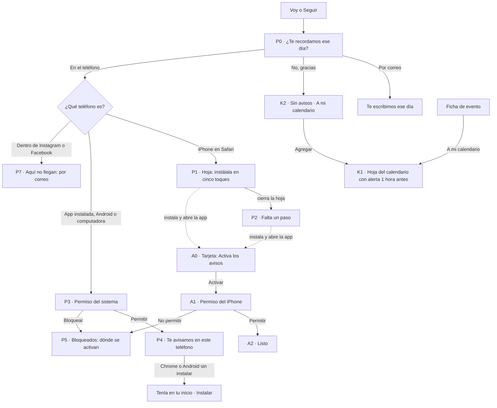

# Instalar la app y activar los avisos · flujo, estados y decisiones (v1.2: firmadas por el founder el 2026-09-16; construidas en la rama instalar-y-avisos, bitácora 064)

**Fecha:** 2026-09-16 (noche) · **Base:** [16-instalar-avisos-fricciones.md](16-instalar-avisos-fricciones.md) (v1.1) · **Carta:** [PRINCIPIOS_UX.md](../PRINCIPIOS_UX.md) · **Firmado antes:** F4 de [01](01-inicio-fricciones.md) y decisión 10 de [02](02-inicio-flujo-y-estados.md) · **Prototipo navegable:** [prototipos/instalar-avisos.html](prototipos/instalar-avisos.html) (publicado para el iPhone en https://claude.ai/artifact/LHH9XsGDzf6V5CFk5CwfV4) · **Quién firma:** el founder.

## El flujo

## Estados

| ID | Estado | Qué ve la persona | Qué puede hacer |
|---|---|---|---|
| P0 | Pregunta tras Voy o Seguir (como hoy) | "Vas a X · Ya estás en la lista de quien va · ¿Te recordamos ese día?"; Por correo · En el teléfono (en la computadora, "En esta computadora"); No, gracias | Elegir un canal; cerrar ("ahora no") |
| P1 | iPhone en Safari: hoja "Instala Somos Nosotros" | "Los avisos del iPhone llegan a la app instalada." Cinco renglones con los iconos de Safari: Toca ··· (abajo a la derecha) · Compartir (el primero del menú) · Ver más (al final de la fila) · Agregar a Inicio (debajo de Buscar en la página) · Agregar (arriba a la derecha). Al pie, el icono SN: "Ábrela desde tu inicio y toca Activar" | Seguir los pasos con la hoja abierta; cerrar |
| P2 | iPhone en Safari: cerró la hoja | Sin palomita: "Falta un paso: instálala y, al abrirla, toca Activar" · Ver los pasos; "Mientras, ¿por correo?" Sí · No | Ver los pasos; elegir correo |
| P3 | App instalada, Android o computadora | El permiso del sistema (iPhone: "Somos Nosotros quiere enviarte notificaciones"; Chrome: "somosnosotros.org quiere mostrar notificaciones") | Permitir; no permitir |
| P4 | Dado de alta | "✓ Te avisamos en este teléfono ese día"; "¿También por correo?" Sí · No. En Chrome o Android sin instalar, al final: "Tenla en tu inicio · Instalar" | Elegir correo; instalar en un toque |
| P5 | Bloqueados | "Los avisos quedaron bloqueados en este teléfono. Se activan en Ajustes del iPhone › Notificaciones › Somos Nosotros" (en Chrome: "en la configuración del sitio"); "Mientras, ¿por correo?" | Elegir correo; ir a los ajustes del teléfono |
| P6 | Falló el alta | "No pudimos darte de alta en este teléfono." · Intentar de nuevo; "o por correo" | Reintentar; correo |
| P7 | Dentro de Instagram o Facebook | "Aquí no llegan avisos: estás en el navegador de Instagram. Ábrela en Safari o elige por correo." · Por correo | Correo |
| A0 | App instalada, primer arranque con avisos pedidos | Arriba de la agenda, con el dibujo de "Completar": campana · "Activa los avisos en este teléfono" · "Para recordarte lo que vas y lo que sigues" · Activar · ✕ | Activar; ✕ (ahora no) |
| A1 | Tocó Activar | El permiso del iPhone | Permitir; no permitir |
| A2 | Permitió | La tarjeta pasa a "✓ Listo: te avisamos en este teléfono" y se va sola en 1.6 s | — |
| A3 | ✕ | La tarjeta se va y no vuelve en ese teléfono; el renglón de Ajustes queda como camino | — |
| J0 | Ajustes › Avisos › En el teléfono | Un subtítulo por estado de este teléfono: "Activados en este teléfono" (encendido) · "Apagados en este teléfono" · "Instala la app para recibirlos" (Safari del iPhone; tocar abre la hoja) · "Bloqueados: se activan en Ajustes del iPhone" (apagado, sin tocar) · "Este navegador no los recibe" (dentro de otra app) | Encender o apagar; instalar |
| J1 | Ajustes › Somos Nosotros › Instalar la app | Solo donde se puede y mientras no esté instalada. Chrome o Android: "Un toque, sin tienda"; Safari del iPhone: "Cinco toques en Safari" (abre la hoja); computadora: "Como app, en su propia ventana" | Instalar |
| K0 | Ficha de evento: el botón | Compartir · **A mi calendario** (calendario con + en la esquina) · Cómo llegar | Tocar |
| K1 | Tocó A mi calendario | La hoja del calendario del teléfono con el evento, el lugar, la hora, la liga y "Alerta: 1 hora antes" | Cambiar la alerta; agregar; cerrar |
| K2 | Contestó "No, gracias" | "Sin avisos. Se cambia en Ajustes." y, debajo, "A mi calendario · Con una alerta 1 hora antes" · Agregar | Agregar (abre K1); nada |
| V0 | Quien visita sin cuenta | La agenda como hoy, sin nada arriba (decidido: opción A) | — |

## Decisiones

1. **Qué puede este teléfono lo deduce el sistema, en este orden:**
   - app ya instalada: permiso directo (P3);
   - iPhone en Safari: la hoja (P1);
   - Chrome, Edge o Android: permiso directo y, después, instalar (P3, P4);
   - dentro de otra app (Instagram, Facebook): correo, con "Ábrela en Safari" (P7).

   "No se puede" solo se dice donde es verdad, con el correo a la vista. Un "sí" nunca se guarda como "no". *UX invisible, Evidencia.* (I1)
2. **La hoja da los pasos del Safari de la persona.** En iOS 26, cinco renglones con los iconos reales, los nombres que muestra el iPhone en español (medidos al construir: la opción se llama "Agregar a Inicio") y la posición de cada uno; en versiones anteriores, Compartir abajo al centro › Agregar a pantalla de inicio › Agregar. Fuera de Safari (Chrome del iPhone, otra app) pide abrirla en Safari: los pasos de Chrome del iPhone no se pudieron comprobar. Sin frases de ayuda; al pie, el resultado y el paso que sigue ("toca Activar"). *Evidencia, Jakob.* (I2, P1)
3. **Lo pendiente se ve pendiente.** Al cerrar la hoja, "Falta un paso" sin palomita, con la oferta del correo una sola vez. La cuenta guarda que quiere avisos en el teléfono. *Evidencia, Zeigarnik.* (I3, P2)
4. **La tarjeta "Activa los avisos" al abrir la app instalada.** Es el objeto arriba que pidió el founder, con motivo.
   - **Cuándo sale:** solo si la persona pidió avisos en el teléfono y este teléfono no tiene permiso.
   - **Dibujo:** el de "Completar" de Mi perfil.
   - **Activar:** es el toque que el iPhone exige para mostrar su permiso.
   - **Confirmación:** una línea que se va sola.
   - **✕:** es "ahora no" y no vuelve en ese teléfono.

   Medido en iOS 26.3: la sesión pasa de Safari a la app instalada y el permiso sale al tocar. *Peak-End, El gesto gana, Similitud.* (A1, A0–A3)
5. **Cada teléfono dice su verdad.** El renglón de Ajustes (J0), la barra de Seguir y la tarjeta de Novedades leen el permiso y el alta de ese teléfono. La cuenta guarda el consentimiento con fecha (como hoy). Los avisos salen mientras haya al menos un teléfono dado de alta: apagar en uno no apaga los demás. Sin canal elegido, la barra de Seguir dice solo "Sigues". *Evidencia.* (E1, A2)
6. **La pregunta solo sale tras un toque.** Cerrar sin contestar es "ahora no": vuelve en el siguiente Voy o Seguir, no al abrir la ficha. La excepción es volver de Entrar tras tocar Voy sin sesión, porque continúa el mismo gesto. *El gesto gana; `ui/Hoja` nunca sale sola.* (E2)
7. **Instalar en un toque donde el navegador lo permite** (Chrome, Edge, Android). Tras "✓ Te avisamos en este teléfono", la línea "Tenla en tu inicio · Instalar" abre el diálogo del navegador. En Ajustes › Somos Nosotros va "Instalar la app" (J1). Instalada, desaparece de los dos sitios. En iPhone, J1 abre la hoja. *Jakob, UX invisible, Peak-End.* (C1, P4, J1)
8. **Errores con causa y salida:**
   - bloqueados: dónde se activan (P5);
   - falló el alta: "Intentar de nuevo" (P6);
   - navegador sin avisos: correo (P7).

   En los tres, el correo como salida. *Evidencia; errores en línea, persistentes y por causa.* (A3)
9. **Textos e icono:**
   - "Se cambia en Ajustes";
   - "En esta computadora" en la computadora;
   - icono chico de Android como silueta SN transparente.

   *Evidencia, Jakob.* (E3, C2, C3)
10. **Quien visita sin cuenta: nada arriba.** Decidido por el founder (2026-09-16, noche): opción A. Instalar aparece donde hay motivo (7). La tarjeta arriba desde la tercera visita queda descartada. *F4 firmada, Atención selectiva.* (V1, V0)
11. **Sin app de la tienda: el iPhone se queda con la app instalada desde Safari.** Decidido por el founder (2026-09-16, noche): la app de la tienda se detiene porque "no suma valor todavía y me entretiene", y en fase de pruebas cada actualización costaría el doble. Se construyen 1 a 9 para la app de inicio, sin aviso de la App Store. *Jakob, UX invisible.* (T1)
12. **"A mi calendario" en la ficha de evento.**
    - **Texto:** dice el destino, cabe en una línea y queda entre Compartir y Cómo llegar.
    - **Icono:** calendario con un + en la esquina, la convención de agregar al calendario, distinta del + al centro de "Publicar evento".
    - **Al tocar:** lo de hoy, la hoja del calendario del teléfono (K1).

    Observación del founder: el botón debe decir que agrega, no parecer que muestra un calendario. *Evidencia, Jakob, Similitud.* (K1, K0)
13. **El evento llega con una alerta 1 hora antes** (K1). La persona la ve en la hoja del calendario y la cambia ahí si quiere.
    - **En el archivo:** la alerta; además se escapa el punto y coma como pide el formato (hoy no se escapa) y el archivo se nombra con el evento.
    - **En Android, por comprobar en un teléfono:** si Chrome solo descarga el archivo, el botón abre el evento en Google Calendar.

    *Evidencia, Peak-End: el recordatorio que el botón promete se cumple.* (K2)
14. **"No, gracias" ofrece el calendario** (K2). "Sin avisos. Se cambia en Ajustes." y, debajo, la línea "A mi calendario · Con una alerta 1 hora antes · Agregar", que abre K1. Es el recordatorio para quien no quiere alertas de ningún tipo; si no la toca, nada más. *Peak-End (el final negativo se diseña), UX invisible.* (K3)

**Excepciones declaradas:**
- **En iPhone, instalar son cinco toques dentro de Safari**, y los avisos web solo llegan a la app instalada. Es un límite de Apple. Se mitiga con los pasos reales, la tarjeta al abrir, el correo y el calendario.
- **Dentro de Instagram o Facebook** no se puede instalar ni recibir avisos: correo o calendario.
- **Un permiso bloqueado solo se deshace en los ajustes del teléfono.**
- **La app no sabe si la persona agregó el evento a su calendario:** tras K1 no se afirma nada.

## Qué sigue

1. ~~El founder recorre en el prototipo el calendario (12 a 14) y firma.~~ Firmado el 2026-09-16 (noche): «Me quedo con tu propuesta».
2. ~~Un PR "Instalar y avisos" con las decisiones 1 a 9 y 12 a 14.~~ Construido en la rama `instalar-y-avisos` y probado en el simulador (bitácora [064](../bitacora/2026/09/064-instalar-y-avisos-construido.md)); sin migración. Falta el push y el PR cuando el founder lo diga.
3. Firma en el iPhone del founder:
   - Safari › Voy › En el teléfono › hoja › instalar › Activar › recordatorio de las 9:00 de un evento del día siguiente;
   - "A mi calendario" con su alerta;
   - "No, gracias" con el calendario.

   Si hay un Android a mano: Instalar en un toque y qué hace "A mi calendario".
