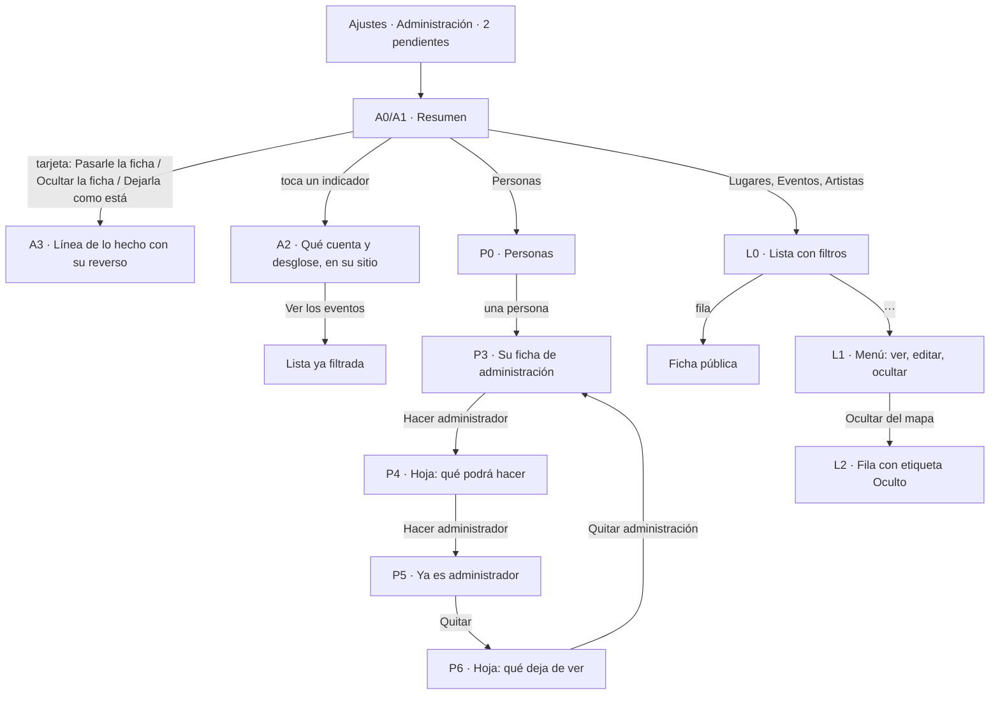

# Administración · flujo, estados y decisiones (v1: firmadas por el founder el 2026-09-16; construidas en la rama panel-admin, bitácora 072)

**Fecha:** 2026-09-16 (noche) · **Base:** [18-administracion-fricciones.md](18-administracion-fricciones.md) · **Carta:** [PRINCIPIOS_UX.md](../PRINCIPIOS_UX.md) · **Canon:** filas de Ajustes ([13](13-novedades-perfil-alta-flujo-y-estados.md), decisión 6), formularios ([15](15-formularios-canon-flujo-y-estados.md)), memoria de pantalla (bitácora [043](../bitacora/2026/09/043-memoria-de-pantalla-y-buscador.md)) · **Prototipo navegable:** [prototipos/administracion.html](prototipos/administracion.html) (publicado para el iPhone en https://claude.ai/artifact/PcgGzqamg82XpZ5yDFkTUn) · **Quién firma:** el founder.

**Firma del founder (2026-09-16, noche):** «Firmo», con D1 = B (solo las cuentas de origen cambian el rol), D2 = A (correo oculto en la lista, completo al tocar "Ver") y D3 = A (se guarda solo el último día que alguien abrió la app).

**Construcción (bitácora [072](../bitacora/2026/09/072-panel-de-administracion-construido.md)):** todo lo de abajo, con las desviaciones declaradas allí. La principal: el dato de atención de Gestionar no abre la lista filtrada, por Fitts. Las demás son de texto y de dibujo: lo hecho sin género, el chip elegido como en la app, la espera sin título y el vacío de búsqueda sin botón aparte.

**Cuentas de origen:** las que nacen administradoras porque su correo está en `admin_correos`. Hoy, las del founder. En pantalla se dice "desde el inicio" y "quien fundó Somos Nosotros".

## El flujo

## Estados

| ID | Estado | Qué ve el administrador | Qué puede hacer |
|---|---|---|---|
| A0 | Resumen, nada pendiente | "Administración". Pendiente: "✓ Nada pendiente · Sin reportes ni reclamos". Últimos 7 días: los cuatro indicadores. Gestionar: cuatro renglones | Abrir un indicador; entrar a una sección |
| A1 | Resumen con pendientes | "Pendiente · 2": una tarjeta por reclamo o reporte, del más viejo al más nuevo; debajo, igual que A0 | Decidir cada tarjeta; abrir la ficha o la persona |
| A2 | Indicador abierto | Bajo su fila: qué cuenta exactamente, el desglose y "Ver los 9 eventos" | Ir a la lista filtrada; cerrar tocando otra vez |
| A3 | Pendiente atendido | La tarjeta se vuelve una línea: "✓ Foro Escénico La Lonja quedó oculto · Mostrar", "✓ Colectivo Barro ahora lo lleva Luis Rangel" o "✓ Reporte cerrado; la ficha sigue igual" | Deshacer con "Mostrar" |
| A4 | Cargando | El título y la forma de los tres grupos en gris, sin números inventados | — |
| A5 | No se leyeron los indicadores | En su grupo: "No pudimos leer los indicadores" · Intentar de nuevo. Pendiente y Gestionar siguen | Reintentar |
| A6 | Falló una acción | En la tarjeta: "No se pudo ocultar: sin conexión" · Intentar de nuevo | Reintentar; dejarla como está |
| A7 | La ficha ya no existe | "La ficha ya no existe" · Cerrar el reporte | Cerrar |
| A8 | La cuenta que reclamó ya no existe | "Pasarle la ficha", apagado, con "La cuenta que la pidió ya no existe" | Dejarla como está |
| P0 | Personas | Buscar por nombre o correo; chips Todas · Nuevas · Sin entrar · Administración, con conteo; renglones foto, nombre (+ Administración), última vez y lo más significativo; tu cuenta como "Tú" | Buscar; filtrar; abrir una persona |
| P1 | Búsqueda sin resultados | "Nadie con «rangle»" · Borrar la búsqueda | Borrar la búsqueda |
| P2 | Filtro vacío | Por causa: "Todas las personas han entrado", "Nadie nuevo en 7 días" | Otro filtro |
| P3 | Ficha de administración | Cabecera: foto, nombre, colonia, perfil público o reservado. Cuenta: correo (oculto · Ver), alta, última vez, avisos. Actividad: va a, sigue, publicó, lleva, reportó. Al final y solo: Rol · Usuario · Hacer administrador. "Ver su ficha pública" | Ver el correo; hacer administrador; ir a lo que lleva |
| P4 | Hoja: hacer administrador | "¿Hacer administrador a Luis Rangel?" · Podrá: atender reportes y reclamos, y pasar fichas a otras cuentas · ocultar, mostrar y editar cualquier ficha · ver la actividad y el correo de todas las personas · "No podrá hacer ni quitar administradores." · [Hacer administrador] | Confirmar; cerrar con la ✕ |
| P5 | Ya es administrador | Sobre el renglón: "✓ Ya es administrador". Renglón: Rol · Administrador · "Desde hoy, lo nombraste tú" · Quitar | Quitar |
| P6 | Hoja: quitar | "¿Quitar la administración a Luis Rangel?" · "Deja de ver Administración. Lo que publicó, ocultó o atendió se queda como está." · [Quitar administración] con borde rojo | Confirmar; cerrar con la ✕ |
| P7 | Rol sin acción posible | El renglón dice por qué: "Aún no confirma su correo: podrás hacerlo administrador cuando entre" · "Administrador desde el inicio: no se quita desde la app" · "Solo quien fundó Somos Nosotros cambia el rol" (lo ve un administrador que no es de origen) | — |
| P8 | Correo a la vista | "luis.rangel@gmail.com" · Copiar → "Copiado" | Copiar |
| P9 | La cuenta ya no existe | "Esta cuenta ya no existe" · Volver a Personas | Volver |
| L0 | Lista de fichas | Buscar; chips con conteo (tabla de [18](18-administracion-fricciones.md)); renglones foto, nombre (+ Oculto), detalle, "···" | Buscar; filtrar; abrir la ficha; abrir el menú |
| L1 | Menú "···" | Hoja con el nombre: Ver la ficha · Editar · separado al final, Ocultar del mapa (o Volver a mostrar) | Elegir; cerrar |
| L2 | Ocultada | La fila en gris con la etiqueta "Oculto"; el conteo de "Ocultos" sube | Volver a mostrar desde "···" |
| L3 | Filtro vacío | Por causa: "Ningún lugar oculto", "Todos los eventos tienen imagen" | Otro filtro |
| J0 | Ajustes › Somos Nosotros | "Administración", icono de tablero, detalle "2 pendientes" o "Nada pendiente" | Entrar |

## Decisiones

1. **Tres grupos en una pantalla, en el orden de la intención:**
   - Pendiente: lo que pide una acción;
   - Últimos 7 días: cómo va;
   - Gestionar: entrar a una lista.

   Sin pendientes, el primer grupo es una sola línea. *Progressive disclosure, Hick, Región común.* (N3, N4)
2. **Una tarjeta por pendiente, una decisión por tarjeta.** Renglones, cada dato en el suyo:
   - qué pide, con icono y verbo propios: "Pide llevar la ficha", "Pide que se quite", "Reporte: no es cultural";
   - la ficha por su nombre y su tipo, como enlace;
   - el mensaje completo, entre comillas;
   - quién lo pide, como enlace a su ficha de administración, y cuándo.

   Dos botones separados 16 px. A la izquierda, "Dejarla como está". A la derecha, la acción: "Pasarle la ficha" (principal) u "Ocultar la ficha" (borde rojo). Los dos cierran el pendiente. *Hick, Fitts, Evidencia, Similitud.* (R1, R2, R3, R5)
3. **Lo hecho queda escrito con su reverso.** La tarjeta se vuelve una línea con palomita y, si se puede deshacer, el reverso ("Mostrar"). Se queda hasta salir del panel. *Evidencia, Peak-End, El gesto gana.* (R4)
4. **Cuatro indicadores de los últimos 7 días:** Personas activas, Coincidencias, Agenda de la semana y Publica la comunidad. Definiciones en [18](18-administracion-fricciones.md).
   - **Forma:** cuadrícula de dos por dos. Cada uno lleva nombre, número grande con letra proporcional, base ("de 36 eventos") y cambio frente a los 7 días anteriores ("▲ 3 más").
   - **Color:** el cambio va en tinta, sin verde ni rojo: la flecha y el signo llevan la dirección, y el rojo de la app queda para errores y borrar.
   - **Primera semana:** el grupo dice "Primera semana: aún sin comparación".
   - **Tendencia:** la línea de 12 semanas aparece solo con 4 semanas de historia.
   - **Personas:** los indicadores de personas no cuentan a los administradores y lo dicen.

   *Evidencia, Miller, Von Restorff.* (N1, N2, N3)
5. **Tocar un indicador lo explica en su sitio.** Debajo de su fila se abren qué cuenta exactamente, el desglose y el enlace a la lista que lo respalda. Tocar otra vez, u otro indicador, lo cierra. *Progressive disclosure, capas b y c.* (N3)
6. **Gestionar con el dibujo de Ajustes.**
   - **Renglón:** icono | sección y total / lo que pide atención | chevron.
   - **Iconos:** los de la barra de abajo (pin para Lugares, calendario para Eventos, estrella para Artistas) y personas para Personas.
   - **Tocar:** el dato de atención abre la lista ya filtrada; el resto del renglón, la lista entera.

   *Conectividad uniforme, Jakob, UX invisible.* (N4)
7. **Personas: buscar, filtrar, leer.**
   - **Arriba:** campo con lupa y ✕ (canon de formularios) y filtros como chips con conteo que viven en la URL.
   - **Renglón:** foto | nombre (+ etiqueta "Administración") / última vez · lo más significativo | chevron.
   - **Orden:** lo más reciente primero. Tu cuenta aparece como "Tú".
   - **Memoria:** al volver se reponen filtro, búsqueda y posición.

   *Canon de listados, memoria de pantalla, UX invisible.* (P1)
8. **La ficha de administración de una persona.**
   - **Cabecera:** foto, nombre, colonia y si su perfil es público o reservado.
   - **Grupos con el dibujo de Ajustes:** Cuenta (correo, alta, última vez, avisos por canal con su motivo) y Actividad (va a, sigue, publicó, lleva, reportó).
   - **Al final y solo:** el grupo Rol.
   - **Salida:** "Ver su ficha pública".

   *Región común, Similitud.* (P1)
9. **Hacer administrador y quitarlo, detrás de una hoja.**
   - **Hacer:** "Hacer administrador" abre la hoja: título con el nombre, "Podrá:" en tres renglones, lo que no podrá y un solo botón. Se cierra con la ✕, sin "Cancelar" (un camino por decisión).
   - **Hecho:** línea "✓ Ya es administrador" y renglón "Administrador · Desde hoy, lo nombraste tú · Quitar".
   - **Quitar:** hoja con lo que deja de ver y botón de borde rojo.
   - **Guardas:** nunca al último administrador; nunca a una cuenta de origen; nunca a quien no ha confirmado su correo; nadie se quita a sí mismo desde aquí. Solo las cuentas de origen hacen o quitan administradores (D1).
   - **Guardas a la vista:** cada una se dice en el renglón; nada se esconde.
   - **Registro:** queda quién cambió el rol y cuándo.

   *Lo destructivo detrás de una capa, Prevención, Hick, Evidencia.* (P2, D1)
10. **Listas de fichas: Lugares, Eventos, Artistas.**
    - **Arriba:** búsqueda y filtros con conteo por lo que pide atención.
    - **Renglón:** foto | nombre (+ "Oculto") / detalle | "···".
    - **Tocar:** el renglón abre la ficha pública; "···" abre el menú de las fichas (Ver la ficha · Editar · separado al final, Ocultar del mapa o Volver a mostrar).
    - **Ocultar no pregunta:** el menú es la capa y la etiqueta es la evidencia.
    - **Memoria:** al volver se reponen filtro, búsqueda y posición.

    *Lo destructivo detrás de una capa, Evidencia, Fitts.* (L1, L2, L3, L4)
11. **Cada acción responde.** Al tocar, el botón se pone en camino y dice lo que pasa ("Pasando…"). Un error queda en línea, dentro de su tarjeta u hoja, con la causa y "Intentar de nuevo". El éxito se ve como en 3 y 9. *Doherty, Evidencia.* (A1)
12. **Entrada y regreso.** Se entra por Ajustes › Somos Nosotros › Administración, con icono de tablero y el estado en el detalle ("2 pendientes"). Atrás del resumen lleva a Ajustes; el de las pantallas nuevas, al resumen. *Topografía de navegación, UX invisible, Jakob.* (A2, A3)
13. **Correo (D2).** En la lista se ve oculto ("lu…@gmail.com"); la búsqueda por correo completo ocurre en el servidor. En la ficha, "Ver" lo muestra con "Copiar". *Privacidad, progressive disclosure.* (D2)
14. **Última vez (D3).** "Abrió la app hoy", "ayer", "hace 5 días", "hace 3 semanas". Sin ese dato, la última entrada con código ("Entró el 13 sep"). *Evidencia.* (D3)

## Ninguna acción se pierde

| Acción de hoy | Dónde queda | Toques hoy | Toques con la propuesta |
|---|---|---|---|
| Cerrar un reporte sin cambiar nada | Tarjeta · Dejarla como está | 1 | 1 |
| Ocultar lo reportado y cerrar el reporte | Tarjeta · Ocultar la ficha | 2 (Ocultar + Marcar atendido) | 1 |
| Pasar la ficha a quien la pide | Tarjeta · Pasarle la ficha | 1 | 1 |
| Ver lo reportado o reclamado | Nombre de la ficha en la tarjeta | 1 (invisible en los reclamos) | 1, siempre visible |
| Ocultar o mostrar uno de los 10 últimos | Lista · ··· · Ocultar del mapa | 1, sin capa | 2, con capa y etiqueta |
| Ocultar o mostrar uno que no está entre los 10 últimos | Lista · buscar · ··· · Ocultar | Fuera del panel | 3 o 4 |
| Hacer administrador a alguien | Personas · persona · Hacer administrador · confirmar | Solo con SQL | 4 |
| Quitar la administración | Personas · persona · Quitar · confirmar | Solo con SQL | 4 |

## Para construir (después de la firma)

- **Resumen:** una función de la base, solo para administradores, que devuelve en un viaje los cuatro indicadores, sus comparaciones y los conteos de Gestionar. Lo pendiente sigue con su consulta, ahora con el nombre de la ficha.
- **Personas:** una función solo para administradores que junta el perfil con su cuenta de acceso (correo oculto, alta, última entrada) y sus conteos. Búsqueda, filtro y páginas de 30, en el servidor.
- **Rol:** una función `cambiar_rol(persona, rol)` con las guardas de la decisión 9, que registra quién y cuándo.
  - El trigger `proteger_rol` se queda como segunda barrera. Tras la revisión de seguridad del PR #74 (bitácora 072), exige también una cuenta de origen, no deja bajar de rol a una cuenta de origen por ningún camino y deja el registro él mismo; un update directo ya no se salta D1.
  - Hay que confirmar en la base si `authenticated` conserva el permiso de actualizar `perfiles` entero (P2 de [18](18-administracion-fricciones.md)). Si lo conserva, se cierra por columnas, en su propia pieza.
- **Nada nuevo en `perfiles`:** esa tabla se lee sin sesión. El registro de roles y el último día que se abrió la app van en tablas que solo lee la administración, y el día se escribe una vez al día por cuenta.
- **Qué pide al founder:** aplicar una migración (funciones y dos tablas). No hay variables de entorno nuevas. El aviso de privacidad suma una línea por D2 y otra por D3.
- **Maquetación:** grid con áreas e hijos directos del contenedor semántico. Al terminar se miden nodos y profundidad del `main`; hoy son 282 nodos y profundidad 8.
- **Piezas:** resumen y pendientes; personas y rol; listas de fichas. Cada una con su prueba en el iPhone.

## Qué no entra

- Suspender, bloquear o borrar la cuenta de otra persona.
- Editar el perfil de otra persona desde el panel.
- Visitas, páginas vistas, tiempo en la app o rankings.
- Gráficas antes de 4 semanas de historia.
- Exportar datos o mandar correos masivos: las invitaciones siguen en `scripts/capo`.
- Avisar a la persona que ahora es administradora: lo ve en Ajustes, y se lo dice quien la nombra.
