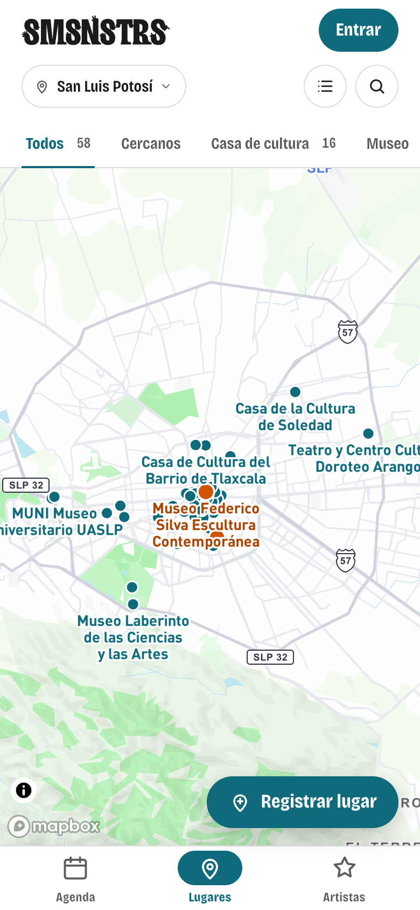
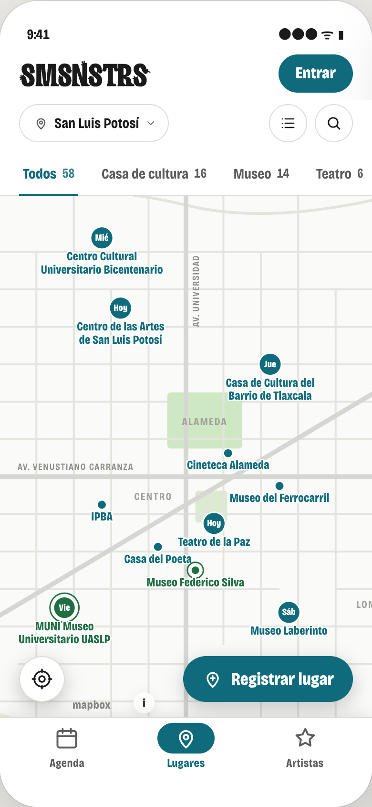
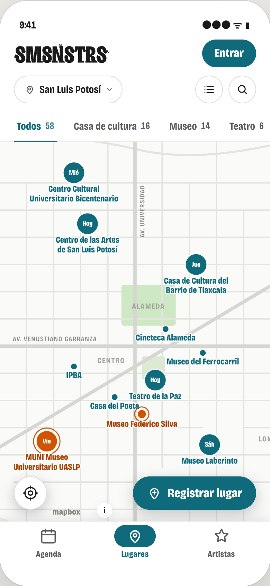
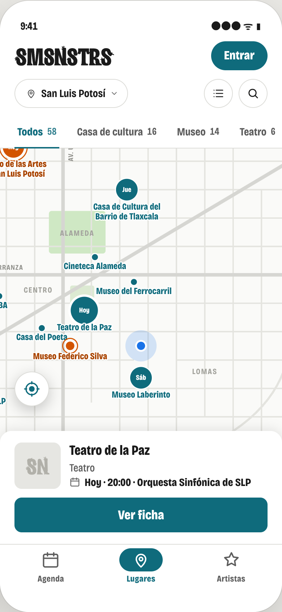
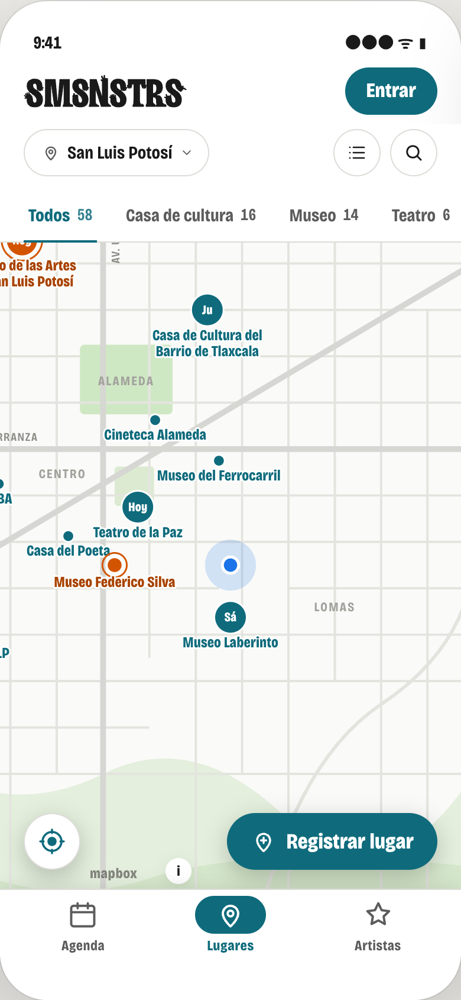

# 35 · Mapa de lugares: ubicación, encuadre y pines con el día

**Estado:** en producción; corrección de pines en curso (OL-128). · **OL:** OL-124 (prototipo), OL-125 (código) y OL-128 (pines) · **Bitácora:** [159](../bitacora/2026/09/159-mapa-lugares-prototipo.md) (prototipo), [160](../bitacora/2026/09/160-mapa-lugares-app.md) (código) y [163](../bitacora/2026/09/163-mapa-pines.md) (pines) · **Pieza:** B1 de la [cola](../ops/COLA_DE_PIEZAS.md). · **Prototipo:** [`prototipos/mapa-lugares.html`](prototipos/mapa-lugares.html) (se abre en el navegador, sin servidor ni llaves).

## Decisiones del founder al ver el prototipo (2026-09-22)

Tras ver la primera entrega, el founder dijo, en el chat del gestor:

1. «Me gusta el prototipo de mapa.»
2. Los días del pin van con **tres letras y acento, como «Hoy»**: «Jue», «Vie», «Sáb» — no «Ju»/«Vi»/«Sá». Aplicado en todo este documento y en el prototipo.
3. De acuerdo con las dos recomendaciones de la primera entrega: **L8 decidido — la sección sigue llamándose «Lugares»**; y **«Cercanos» sale de las pestañas del mapa** (se queda en Lista).
4. «No has agregado botón de ubicación en mapa»: el botón ya estaba en los tres estados, pero en «pin tocado» la hoja lo tapaba. Corregido: ver «El botón de ubicación» más abajo.
5. **Tras firmar el documento, el founder cambió quién lleva el resalte del mapa**, literal: «ahora los lugares en rojo son los destacados. Pero creo que de cara al usuario es más útil que se resalten los seguidos.» **El resalte (el color y el aro que este documento daba a los destacados) lo llevan los lugares que la persona sigue, no los destacados.** Sin sesión no hay resalte y no se pide entrar por esto; un destacado que además se sigue se ve como seguido. Aplicado en todo este documento (tabla de pines, capturas) y en el prototipo.
6. **Tras probar OL-125 en producción con su iPhone, el founder pidió cuatro correcciones a los pines (2026-09-22, OL-128), literales:** «El letrero de día se muestra y oculta según zoom en mapa, y el envolvente circular tiene mucho padding, pienso que se puede compactar más el pin. […] a los resaltados los pintamos naranjas pero no les ponemos día. Por último los resaltados, como son seguidos se les debe poner el mismo color de seguidos, revisa consistencia en lenguaje visual. En general los tamaños de pines de mapa son: Lugar normal sin fecha (pin pequeño), Lugar con fecha (pin mediano con tres letras de día), Lugares seguidos, con fecha y sin fecha.» Los cuatro, aplicados: **(a)** el día ya no se esconde al cambiar de zoom (`text-allow-overlap`/`text-ignore-placement`, con un seguido ganando el sitio si dos días chocan); **(b)** el círculo mediano se compactó de 32 a 24 px (abraza «Sáb» con 2–3 px de aire, no el margen amplio de antes); **(c)** dos tamaños solamente (pequeño sin fecha, mediano con fecha), iguales para un lugar normal y uno seguido — el seguido cambia de color y lleva el aro, nunca de tamaño; **(d)** el color de los seguidos deja el naranja de los destacados y pasa al verde de «Sigues» (`--ok`, `#1f6f43`, el mismo de `ui/BotonRenglon` `.decidido`): es la elección de la persona, no la del administrador, y la casa ya tenía un color para eso. Aplicado en todo este documento y en el prototipo.

## De dónde sale

La lista del founder del 2026-09-21, tal cual:

- **L7.** «Agregar botón de ubicación actual y encuadre en mapa de lugares».
- **L11.** «Distinguir lugares con eventos pronto, considerar poner Hoy o "22" (fecha con formato calendario) del evento en el pin».
- **L31.** «En el mapa se resaltarán lugares destacados y con eventos esta semana, recordar volver a poner el botón de ubicación actual. Se puede usar el extremo inferior izquierdo similar a posición de back to top de listados para mantener consistencia».
- **L8.** «Considerar cambio de nombre de lugares a mapa». **Decidido el 2026-09-22:** la sección sigue llamándose «Lugares» (ver la sección L8 más abajo, con los argumentos que el founder confirmó).

## Qué se ve hoy

Captura real de somosnosotros.org/lugares tomada con Chrome a 390×844 el 2026-09-22 (`capturas-35/produccion-mapa-hoy--390x844.png`). Lo que se ve:

- **Al abrir, el mapa encuadra los 58 lugares a la vez.** Sale la ciudad entera y los lugares del centro quedan apelotonados en una bola de puntos con los nombres encimados («Casa de Cultura del Barrio de Tlaxcala» sobre «Museo Federico Silva»). Para ver algo hay que acercar con los dedos.
- **Ningún punto dice si el lugar tiene evento.** Todos son iguales: un punto del color de acción de 10 px. Un lugar con evento solo «gana el sitio» a otro cuando sus nombres chocan, y eso no se nota. El único que se distingue es el destacado (naranja): hoy, el Museo Federico Silva.
- **No hay botón de ubicación.** La ubicación se pide con la pestaña «Cercanos» de arriba, que centra el mapa en la persona. Fue lo que L31 pidió volver a poner.
- **La esquina de abajo a la izquierda la ocupa la ⓘ de Mapbox**, justo donde en los listados va el botón ↑ de volver arriba. La marca «mapbox» está debajo.
- **Abajo a la derecha, «Registrar lugar».** Al tocar un punto sale una tarjeta flotante (foto, nombre, tipo, «Próximo: sáb 26 sep · 19:00», botón chico «Ver») y Registrar se esconde.

## Qué cambia

1. **El encuadre al abrir** muestra lo que importa esta semana, no toda la ciudad.
2. **Cada pin dice cuándo:** «Hoy» o el día en tres letras con acento («Jue», «Vie»…) si el lugar tiene evento en los próximos siete días.
3. **Los lugares que la persona sigue llevan un aro y su color**, con sesión (decisión del founder tras firmar, ver arriba).
4. **Botón de ubicación abajo a la izquierda**, el mismo botón que el ↑ de los listados, visible en todo momento (también con la hoja de un lugar abierta).
5. **La tarjeta del pin es una hoja corta** con el nombre, el próximo evento y «Ver ficha».

Y dos consecuencias, decididas por el founder el 2026-09-22: **«Cercanos» sale de las pestañas del mapa** (el botón hace lo mismo) y la ⓘ de Mapbox se mueve junto a la marca.

## Cómo se decide el encuadre

El mapa no filtra nada: todos los lugares siguen ahí al moverlo con el dedo. Solo cambia qué se ve al abrir (el contexto ordena, no limita).

- **Sin ubicación:** el mapa abarca los lugares con evento en los próximos siete días y los destacados. Si con eso quedan menos de tres, se completa con los lugares más cercanos al centro de la ciudad hasta llegar a seis. Nunca se acerca más que a la escala de barrio (la misma que hoy usa la búsqueda) ni se aleja más que la ciudad entera. Con cero lugares queda la ciudad, como hoy.
- **Con ubicación:** la persona al centro (el punto azul de siempre) y el mapa se acerca hasta que quepan los cinco lugares más cercanos; con el mismo tope de cerca y de lejos. Mover el mapa con el dedo no quita el punto azul; volver a tocar el botón vuelve a centrar.
- **Con un tipo elegido (Museo, Teatro…) o una búsqueda:** igual que hoy, se encuadra lo encontrado.
- **«Esta semana» es la misma regla que en la agenda:** hoy y los seis días que siguen (`tramo` en `src/lib/fechas.ts`). Así ningún día de la semana se repite dentro de la ventana y las tres letras no dan lugar a duda.

## Qué muestra cada pin

Los lugares siguen siendo capas del propio mapa (círculo y nombre), no elementos encima: el mapa resuelve los choques y la escala (decisión del 2026-09-14). Solo se añade texto dentro del círculo.

Dos tamaños solamente, iguales para un lugar normal y uno seguido: el tamaño lo decide si hay fecha o no; el color y el aro, si la persona lo sigue (corrección del founder, 2026-09-22, OL-128: «en general los tamaños de pines de mapa son: lugar normal sin fecha (pin pequeño), con fecha (pin mediano)… los resaltados, con fecha y sin fecha»).

| Lugar | Pin | Nombre debajo |
| --- | --- | --- |
| **Pequeño** — sin evento en siete días | Punto de 10 px del color de acción con línea blanca (como hoy) | Del color de acción |
| **Mediano** — con evento en los próximos seis días | Círculo de 24 px (compactado de 32, OL-128: abraza «Sáb» con 2–3 px de aire) con el día en tres letras con acento, en blanco y negrita: Lun, Mar, Mié, Jue, Vie, Sáb, Dom; **nunca se esconde al cambiar el zoom** (`text-allow-overlap`, OL-128) | Igual; gana el sitio a los puntos si chocan |
| Mediano, con evento hoy | El mismo círculo con «Hoy» | Igual |
| **Seguido** (con sesión), pequeño o mediano según tenga día | El mismo tamaño que le tocaría sin serlo, con el verde de «Sigues» (`--ok`, `#1f6f43`, no naranja: corrección del founder, OL-128) y un aro del mismo verde; encima de todos | Verde de «Sigues»; gana el sitio a todos |
| Seguido con evento | El círculo mediano en verde con «Hoy» o el día, con su aro; su día es el que menos se esconde si dos chocan (máxima prioridad de `symbol-sort-key`) | Igual |
| Destacado (sin seguirlo, o sin sesión) | Como cualquier lugar: el resalte ya no es suyo | Del color de acción |
| El que tiene la tarjeta abierta | Crece un 30 % (el tamaño base, pequeño o mediano, sigue mandando) | Igual |
| Privado (solo lo ve el administrador) | Gris, como hoy | Gris |
| Sin sesión | Nunca hay resalte verde: ningún lugar se distingue por seguido, y no se pide entrar por esto | — |

Por qué el día en letras y no el número que proponía L11 («22»): con una ventana de siete días, «Jue» dice más que «24» (la persona piensa «el jueves», no «el 24»), y «Hoy» queda como la única palabra distinta, la que más importa. Mañana no lleva palabra propia: muestra su día, para que la regla sea una sola.

**Por qué seguidos y no destacados** (founder, tras firmar el documento, 2026-09-22): «de cara al usuario es más útil». Un destacado es una decisión del administrador sobre la ciudad entera; un seguido es la propia elección de la persona sobre lo que le importa a ella. En un mapa que ella toca para orientarse, resaltar lo suyo pesa más que resaltar lo que otro decidió destacar. El aro se queda, pero no el naranja: al probarlo en producción el founder pidió (OL-128) que el resalte use el verde de «Sigues» en vez del naranja de los destacados, «revisa consistencia en lenguaje visual» — ver el punto 6 de las decisiones, arriba. Sin sesión, sin seguidos que resaltar, el mapa se ve igual que antes de esta decisión.

Captura del prototipo actualizado: el Centro de las Artes (destacado, con evento hoy) se pinta como cualquier lugar con evento, en tinta; el Museo Federico Silva (destacado y seguido) y el MUNI Museo Universitario UASLP (solo seguido) llevan el naranja y el aro.

**Por qué tres letras y no dos** (decisión del founder, 2026-09-22, sobre la primera entrega que proponía «Ju»/«Vi»/«Sá»): con dos letras, «Ma» y «Mi» quedan a una letra de distancia y piden mirar dos veces; con tres, «Mar» y «Mié» no se confunden y el acento hace el trabajo que antes hacía la memoria. Es el mismo tamaño para «Hoy» y para cualquier día, así que no hay dos reglas de ancho.

**Por qué 24 px y no 32** (corrección del founder, 2026-09-22, OL-128, sobre lo publicado en producción: «el envolvente circular tiene mucho padding, se puede compactar más el pin»): a 10 px de letra, «Sáb» en DIN Pro Bold mide unos 19 px de ancho; un círculo de 32 px le dejaba cerca de 7 px de aire a cada lado, más de lo que hace falta para leerlo. A 24 px el aire baja a 2–3 px por lado — lo justo para que la letra no toque el borde, sin la bola de espacio vacío que el founder señaló. **Por qué el día nunca se esconde** (mismo encargo: «el letrero de día se muestra y oculta según zoom»): Mapbox retira por defecto los símbolos que chocan al acercar o alejar el mapa (colisión entre "Hoy"/días vecinos, o con los nombres); con `text-allow-overlap` y `text-ignore-placement` en esa capa, el día se pinta siempre, y el `symbol-sort-key` (seguido, luego con día, luego el resto) decide quién queda encima si de verdad se superponen dos.

Los nombres del mapa siguen en la letra del estilo de Mapbox (DIN Pro Bold), como hoy; el prototipo los dibuja con Bricolage porque no carga Mapbox.

## Qué pasa al tocar un pin

Sale una **hoja corta** pegada abajo, de borde a borde, encima de la navegación:

- Imagen del lugar (sin foto, el símbolo SN ya generado, en cuadro redondeado).
- Nombre, tipo y, si es destacado, la etiqueta «Destacado» con su punto naranja.
- El próximo evento en una línea: «Hoy · 20:00 · Orquesta Sinfónica de SLP». Sin evento: «Sin eventos próximos».
- Un solo botón, a lo ancho: **«Ver ficha»**. Una decisión por pantalla.

Mientras la hoja está abierta, **«Registrar lugar» se retira** (hoy ya lo hace) **y el botón de ubicación sube justo encima de la hoja**, sin taparse nunca (el founder lo pidió explícitamente al ver la primera entrega: «no has agregado botón de ubicación en mapa» — estaba, pero la hoja lo cubría). Tocar el mapa la cierra; tocar otro pin la cambia. No apila historial: es la misma pantalla (filtrar no es navegar).

Lo que cambia respecto a la tarjeta de hoy: ocupa el borde inferior en vez de flotar; dice el nombre del evento y no solo la fecha; y el botón es grande y va en la zona del pulgar, en vez del «Ver» chico a la derecha.

## El botón de ubicación

- **Dónde y cómo:** abajo a la izquierda, a 20 px del borde y a 16 px sobre la navegación. Es el mismo botón que el ↑ de los listados (`.volver` en `src/components/ui/Cabecera.module.css`): 48 px, redondo, blanco, con borde y la sombra flotante.
- **Nunca se tapa.** Con la hoja de un lugar abierta, el botón sube justo por encima de su borde superior en vez de retirarse; la distancia que sube es la altura real de la hoja en ese momento (cambia según si el lugar tiene evento o es destacado), no un número fijo. Es la corrección que pidió el founder al ver la primera entrega. «Registrar lugar» sí se retira, como ya hace hoy: es una acción de alta, no de lectura del mapa, y no hace falta mientras se mira un lugar.
- **Al tocarlo:** pide la ubicación al navegador (como hoy hace «Cercanos»), no la guarda y centra el mapa en la persona. Mientras llega, el icono late como los chips «en camino»; sin texto. Con ubicación, el icono pasa al color de acción con el centro relleno; volver a tocarlo vuelve a centrar.
- **Si la persona la niega o falla:** el mismo aviso de hoy encima del mapa («No pudimos leer tu ubicación. Actívala para este sitio en los ajustes del teléfono») y el botón sigue ahí.

**El icono.** Es la mira de ubicación que ya existe en la app (`IconoUbicacion`: un círculo con una cruz y el punto al centro), la misma que usan hoy los botones «Estoy aquí» de las hojas Dónde está (`src/app/lugares/HojaDonde.tsx`) y Dónde es (`src/app/eventos/HojaDondeEs.tsx`). Se mantiene por dos razones: es la única palabra visual que la app ya usa para «esto me ubica a mí» (ley de Jakob: quien ya la vio en una ficha la reconoce en el mapa sin aprender un icono nuevo) y es el símbolo estándar de «mi ubicación» en los mapas del teléfono (Google Maps, Apple Maps, el propio Mapbox lo usan igual). Se consideró la flecha de navegación que usa Apple Maps para «mostrar mi posición y mi rumbo» (un triángulo o una saeta), pero esa flecha en los mapas de iPhone significa además «hacia dónde miro», algo que esta app no muestra: usarla sin esa función confundiría más de lo que aclara. Con la ubicación activa, el icono pasa al color de acción con el punto central relleno — la misma señal que ya usan otros botones activos de la app (los chips, la píldora de la navegación).

Dos consecuencias, decididas por el founder el 2026-09-22:

1. **«Cercanos» sale de las pestañas del mapa** (recomendación aceptada): con el botón, la pestaña sería un segundo mando para la misma decisión, y eso lo prohíbe la casa (progressive disclosure: «jamás dos accionables para la misma decisión»). En la **Lista**, «Cercanos» se queda, porque ahí ordena los renglones por distancia. Las pestañas de Mapa y Lista quedan distintas por un chip; el tipo elegido sigue compartido por la URL, como hoy.
2. **La ⓘ y la marca de Mapbox** (la licencia pide que las dos se vean) se ponen **por encima del botón de ubicación**, con su mismo borde izquierdo. Mapbox deja elegir su posición; hoy están en la esquina izquierda. **Dos correcciones del gestor (2026-09-22, OL-128):** esto quedó escrito en el doc pero no se codificó en OL-125; primero se puso centrada entre el botón de ubicación y «Registrar lugar», pero a ese ancho la palabra «mapbox» quedaba detrás del borde de «Registrar lugar» (el hueco central no alcanza en 390 px). Se corrigió a encima del botón de ubicación: `src/components/Mapa.module.css` alinea el contenedor `mapboxgl-ctrl-bottom-left` (donde viven juntos el logo y la ⓘ) al mismo `left` que el botón, y calcula su `bottom` con el mismo término de `--alto-hoja` que sube el botón sobre la hoja del pin, más el alto del botón y 8 px de aire — así nunca coincide con el botón, con «Registrar lugar» (a la derecha) ni con la hoja abierta, se mida cuando se mida. Comprobado con `getBoundingClientRect()` en los dos estados (sin hoja y con ella): sin solape en ninguno. Capturas `atribucion-mapbox--390x844.png` y `atribucion-mapbox-con-hoja--390x844.png`.

## Estados

- **Vacío por causa:** sin lugares en la ciudad, el mapa muestra la ciudad y el texto de hoy; una búsqueda sin resultado dice «Ningún lugar se llama así. Si existe, regístralo», como hoy.
- **Carga:** «Cargando el mapa…», como hoy. El botón de ubicación no sale hasta que el mapa está listo.
- **Error con salida:** sin token o sin mapa, el aviso de hoy; ubicación negada, el aviso con la salida a los ajustes.
- **Éxito:** los tres estados del prototipo.

## L8 · ¿«Mapa» o «Lugares»? Decidido por el founder (2026-09-22)

**La sección sigue llamándose «Lugares».** El founder confirmó la recomendación de la primera entrega, con estos cuatro argumentos:

1. **La pestaña nombra lo que la persona busca, no la herramienta.** Alguien quiere saber a dónde ir; el mapa es la forma de verlo. «El texto habla del mundo de la persona, nunca de la maquinaria» (UX invisible).
2. **Lugares tiene dos vistas, y la lista no es un mapa.** «Mapa › Lista» se leería raro; «Lugares › Mapa · Lista» se lee solo.
3. **El icono ya es un pin.** Dice «mapa» sin decirlo. La navegación queda Agenda · Lugares · Artistas: los tres tipos de ficha del grafo cultural (doc 24), en paralelo.
4. **Convención.** Las apps que se llaman «Mapas» son mapas; la nuestra es un directorio que se ve en un mapa (ley de Jakob).

Queda registrado, con honestidad, lo que se dijo a favor de «Mapa»: con los pines diciendo «Hoy» y el día, el mapa se vuelve «la agenda sobre el mapa», y mucha gente dice «ver el mapa»; es una palabra más corta. Si el founder cambia de opinión más adelante, el costo es bajo: una etiqueta en la navegación y el título de la pestaña del navegador; la búsqueda seguiría diciendo «Buscar un lugar».

## Lo que no cambia

El estilo claro y plano del mapa, los colores (acción y naranja), que la ubicación no se guarda y solo sirve para centrar, los chips de tipo, la búsqueda con su encuadre, la memoria de pantalla al volver de una ficha, «Registrar lugar», y que todo sigue siendo capas de Mapbox.

## Prototipo y capturas

`prototipos/mapa-lugares.html`: tres teléfonos a 390×844 con la misma pantalla. El mapa está dibujado a mano en SVG (calles, la Alameda, los cerros del sur), sin Mapbox ni token; los lugares son nombres reales del catálogo en posiciones inventadas. Tocar un pin abre su hoja, tocar el mapa la cierra, el botón pone o quita la ubicación. Fuente Bricolage Grotesque cargada de Google Fonts, como en los demás prototipos.

Capturas reales (Chrome de la Mac por `playwright-core`, `document.fonts.check('16px "Bricolage Grotesque"')` = true, 390×844 a doble densidad), en [`capturas-35/`](capturas-35/):

- `produccion-mapa-hoy--390x844.png` — producción hoy: toda la ciudad de golpe, los puntos del centro apelotonados y encimados, un destacado naranja, la ⓘ de Mapbox abajo a la izquierda y ningún botón de ubicación.
- `prototipo-sin-ubicacion--390x844.png` — al abrir: seis lugares con evento, pines medianos y compactos (dos «Hoy»; «Mié», «Jue», «Vie», «Sáb»), el Museo Federico Silva y el MUNI en verde con aro (seguidos), puntos chicos para el resto, el botón de ubicación en tinta abajo a la izquierda y «mapbox ⓘ» entre los dos botones.
- `prototipo-con-ubicacion--390x844.png` — tras tocar el botón: el punto azul con halo al centro del mapa, los lugares cercanos alrededor (Teatro de la Paz «Hoy», Museo Laberinto «Sáb», Museo Federico Silva en verde, sin día) y el botón en el color de acción con el centro relleno.
- `prototipo-pin-tocado--390x844.png` — Teatro de la Paz tocado: el pin «Hoy» compacto crece, abajo la hoja con el símbolo SN, «Teatro de la Paz», «Teatro», «Hoy · 20:00 · Orquesta Sinfónica de SLP» y el botón «Ver ficha» a lo ancho; «Registrar lugar» se retiró y el botón de ubicación quedó visible, justo encima del borde superior de la hoja.
- `prototipo-seguidos--390x844.png` — con sesión inventada: el Museo Federico Silva (destacado y seguido) y el MUNI (solo seguido, con «Vie») llevan el verde de «Sigues» y el aro, con el pin compacto; el Centro de las Artes, destacado pero no seguido, se ve como cualquier lugar con evento (círculo del color de acción con «Hoy»), sin aro ni verde.

**Capturas de la app real con Mapbox de verdad (OL-128, corrección de pines):** `next build && next start` contra un respaldo local de datos inventados y el token público de Mapbox (nunca en git), con sesión y seguidos como en el prototipo. Chrome vía `playwright-core`, 390×844 a doble densidad, en `capturas-35/`:

- `app-mapa-zoom-barrio--390x844.png` — encuadre inicial: los mismos doce lugares del prototipo, ya con Mapbox de verdad; el Museo Federico Silva y el MUNI en verde con aro, el resto en tinta, con «Hoy»/día en los pines medianos y compactos.
- `app-mapa-zoom-ciudad--390x844.png` — alejado (varias colonias a la vez): el día sigue legible en todos los pines, ninguno se esconde por el cambio de zoom.
- `app-mapa-zoom-calle--390x844.png` — acercado (calles con nombre): el pin compacto y el aro de los seguidos se distinguen con nitidez, sin verse apretados ni con espacio de sobra.
- `app-mapa-sin-sesion--390x844.png` — mismo encuadre, sin sesión: el Museo Federico Silva y el MUNI vuelven a la tinta normal, sin verde ni aro (confirma que el resalte depende de `seguidos`, no está fijo en el estilo).
- `atribucion-mapbox--390x844.png` — la ⓘ y la marca «mapbox» por encima del botón de ubicación, con su mismo borde izquierdo, sin tocarlo ni tocar «Registrar lugar» (segunda corrección del gestor, 2026-09-22: la primera, centrada entre los dos botones, tapaba «mapbox» detrás de «Registrar lugar»).
- `atribucion-mapbox-con-hoja--390x844.png` — con la hoja de Teatro de la Paz abierta: la ⓘ y la marca suben junto con el botón de ubicación (el mismo término de `--alto-hoja`), sin tocar la hoja.

## Qué toca en el código cuando se firme (para el operador)

- `src/components/Mapa.tsx`: el encuadre inicial (lugares de la semana y los cercanos; con ubicación, los cinco cercanos); en la capa de puntos, dos tamaños según `dia` (pequeño sin él, mediano con él, 24 px, compacto); una capa de texto para «Hoy»/día dentro del círculo, con `text-allow-overlap` para que nunca se esconda; el aro y el verde de «Sigues» (`--ok`) para los **seguidos** (no los destacados ni el naranja: cambio del founder tras firmar y corrección OL-128, ver arriba) — con sesión, viene del arreglo de `seguidos` que ya carga `page.tsx`; la ⓘ junto a la marca. La etiqueta del día se calcula en el servidor con la zona del evento (`ProximoEvento.zona`) y llega en las propiedades del punto.
- `src/app/lugares/VistaLugares.tsx` y `lugares.module.css`: el botón de ubicación (reutiliza `pedirUbicacion`), que debe medir la hoja abierta y subir por encima (el prototipo lo hace con `getBoundingClientRect`; en React puede ir por `ResizeObserver` o CSS con `anchor-name`, lo que dé el resultado más simple); la tarjeta como hoja; «Cercanos» solo en la vista Lista.
- Sin migraciones ni variables nuevas si el encuadre y el resalte se resuelven con lo que ya carga `page.tsx` (`eventosSemana`/`conProximo` y `seguidos`, ya presentes); solo si hiciera falta una consulta agregada nueva en el servidor, usar la migración reservada (solo añade, banco de contrato). Pruebas focalizadas: la función que da «Hoy», «Jue» o nada según la fecha y la zona; la selección de lugares del encuadre; que el botón de ubicación no quede tapado por la hoja en ningún alto de contenido; captura 390×844 de los tres estados en el iPhone del founder, y de sin sesión / con sesión y seguidos.
